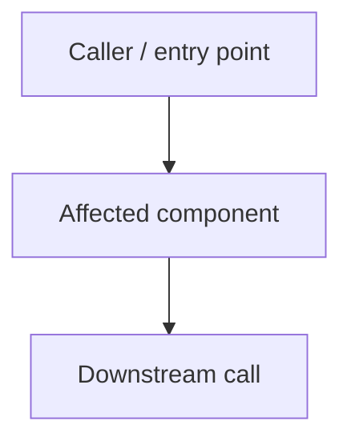
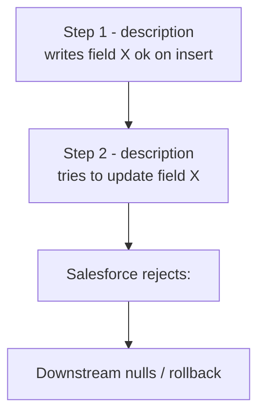

<!--
  TEMPLATE: Bug-fix changes doc
  =============================
  Copy this file to changes/<short-kebab-slug>.md and fill it in.
  Delete every <!-- ... --> guidance comment as you go.
  Strip any sections that genuinely do not apply (note "n/a" rather than deleting
  the heading if the section is part of your team's required minimum).

  Naming: short kebab-case describing the bug or the system that broke.
    Good: account-trigger-recursion-fix.md, omniscript-bulk-import-permission-error.md
    Bad:  fix1.md, BUG-12345.md, JIRA-fix.md
-->

# <Short title — what was broken and got fixed>

**Date:** YYYY-MM-DD
**Sandbox:** `<sandbox-alias>`
**Lead:** <Name> (<role — e.g. developer, sysadmin, sysadmin + developer>)
**Story / ticket:** [<TRACKER-NNN>](<url>) — <one-line summary> (or "ad-hoc bug found by <person> on <date>" if no ticket)
**Code commit(s):** [`<short-hash>`](#15-deploy-ids-and-commit-references) (latest; full list in section 15)
**Manifest:** [`manifest/<feature>.xml`](../manifest/<feature>.xml) (the deploy manifest used; XML inlined in section 15)
**Status:** Resolved / Resolved for <subset>, pending observation on <other subset> / In progress

<!--
  For "Status" — be honest. If only one of three sub-scenarios was verified, say so here and detail in section 12.

  **Code commit(s)** — singular hash for a one-shot fix; comma-separated
  list when this thread iterated and the same doc grew over multiple
  commits (see the "Revision log" section below).

  **Manifest** — REQUIRED when the fix involved `sf project deploy start
  --manifest <file>`. If you didn't use a manifest, write "n/a — used
  `--metadata` flags only" and list those flags in section 15.
-->

---

## 1. TL;DR + status

<!--
  3-6 sentences. Plain English. Anyone on the team should be able to read this and
  understand: what broke, why, what was fixed, what was verified, what is still open.
  No jargon, no acronyms without expansion on first use.

  If this thread spans multiple commits, this section describes the CUMULATIVE
  state of the fix as of the latest commit — not just the latest patch.
-->

---

## 2. Revision log

<!--
  ONE row per code commit on this thread. New commits APPEND a row here
  rather than spawning a new doc. See `.cursor/rules/changes-doc-mandatory.mdc`
  "Same thread, same doc" for the rule.

  - "What was done" — one-line plain English.
  - "Why" — what surfaced the need for this iteration (initial discovery,
    new symptom found after first fix, regression observed in QA, etc.).
  - For a one-shot fix that ships in a single commit, this is a one-row
    table — that's fine.
  - If an iteration superseded a previous approach, mark the older row
    "(superseded by <hash> — see row N)". Don't delete superseded rows.
-->

| # | Date (UTC) | Code commit | What was done | Why |
|---|---|---|---|---|
| 1 | YYYY-MM-DD HH:MM | [`<short-hash>`](#15-deploy-ids-and-commit-references) | <one-line plain English> | <initial discovery / QA finding / cascade> |

---

## 3. Architecture / context

<!--
  Just enough architecture for a reader to follow the rest of the doc. Skip if the
  bug is in a single isolated component. Lean on a mermaid diagram if the flow has
  more than ~3 hops.

  Reference the canonical architecture doc if one already exists rather than
  re-explaining (e.g. "see docs/flows/<flow>.md for the full call tree").
-->



| Type / variant | Path | Status today |
|---|---|---|
| <Variant A> | `<file/component path>` | <Fixed / Untouched / Pending> |
| <Variant B> | `<file/component path>` | <Fixed / Untouched / Pending> |

---

## 4. Trigger — what changed and when

<!--
  When did the bug start appearing? Tie it to a concrete event:
    - A managed package upgrade (cite version diff)
    - A platform/seasonal release (Spring/Summer/Winter '<yy>)
    - A merged PR (cite commit hash)
    - A configuration change in the org (cite Setup audit trail entry)

  If you don't know the trigger, say so: "Unknown trigger; first reported by <user>
  on <date>." Investigation steps to identify the trigger belong in section 7.
-->

Diff of the triggering change (if known):

```diff
- <previous state>
+ <new state>
```

**Behavioral change observed:** <one paragraph on what shifted in the platform/code/data that exposed this bug>

---

## 5. Symptom timeline

<!--
  Each row is one observable failure mode. Useful when fixing one symptom revealed
  another (cascade). Reference the run / deploy that exposed each symptom.

  If the bug had a single symptom and a single fix, this can be a one-row table.
-->

| Run window | Status | Visible error / symptom | Underlying cause uncovered |
|---|---|---|---|
| <date/time> | Failure | `<error message>` thrown by `<component>` | <Family 1 — short label> |
| After fix #1 | Failure | `<next error message>` | <Family 2 — short label> |
| After fix #2 | Success | (clean) | — |

---

## 6. Root cause analysis

<!--
  One subsection per error family. For each:
    - Field/component metadata (describe results, schema queries, package versions)
    - Why the prior state tolerated it
    - Why the new state rejects it
    - What the surface error message actually means (often misleading)

  This is the section future-you will reread to understand WHY, not just WHAT.
  Be generous with detail.
-->

### Family 1 — <short label>

**Metadata** (verified by <how — anonymous Apex, schema query, Tooling API, etc.>):

| Object | Field/component | Property A | Property B | Property C |
|---|---|---|---|---|
| `<SObject>` | `<Field>` | <value> | <value> | <value> |

**Why the prior state tolerated it:** <one paragraph>
**Why the new state rejects it:** <one paragraph>

### Family 2 — <short label>

<!-- repeat the same shape -->

### Family 3 — <short label>

<!-- repeat — most bugs have 1-3 families; if you have more, consider whether they're really separate bugs -->

The cascade in the failing run (if multi-family):



---

## 7. Diagnostic methodology

<!--
  How did you find each root cause? This is the runbook for the next person who
  hits a similar bug. Keep it reproducible.

  Common patterns:
    - Bulk metadata scan (e.g. all DataRaptors in a flow, all triggers on an SObject)
    - Schema queries via Tooling API (EntityParticle for field properties)
    - Targeted Apex log retrieval with TraceFlag scope
    - Anonymous Apex describe calls
    - Test-data sandboxing (a known-clean account, see find-clean-test-account rule)
-->

### <Investigation step 1 — short label>

**Procedure** (reproducible by any developer with `sf` CLI access):

1. <Concrete step 1>
2. <Concrete step 2>
3. <Concrete step 3>

**Tooling used:**
- `sf data query --query "..." --use-tooling-api -o <sandbox-alias>`
- Anonymous Apex: `<gist of the script>`
- Etc.

### <Investigation step 2>

<!-- repeat -->

### Real-commit verification

<!--
  How did you verify the fix in the org? Be specific about commit modes
  (e.g. OmniStudio shouldCommit:true, batch real-mode), Apex log capture,
  TraceFlag scope/duration, and how counts/behavior were checked.
-->

---

## 8. Permanent fixes — <N> changes (safe to promote)

<!--
  The list of changes that should ride to UAT/Pre-Prod/Production. Each row should
  prove safety: why does the disable/edit have zero functional impact, or why is
  the new behavior provably correct?
-->

| # | File | Change | Why safe |
|---|---|---|---|
| 1 | [`<path>`](<path>) | <one-line summary> | <one-paragraph proof of safety> |
| 2 | [`<path>`](<path>) | <one-line summary> | <one-paragraph proof of safety> |

### Drift files (no semantic change by us)

<!--
  If `sf project retrieve` pulled down files that differ from your local copy but
  weren't edited by you, list them here so reviewers don't get confused by the
  diff. State that you didn't change anything semantic.
-->

[`<path>`](<path>) was retrieved during diagnosis but had no edit by us; the modified state matched the org pre-retrieve. Included in this commit for metadata-freshness only.

---

## 9. Key changes — diff-style highlights

<!--
  `git diff` is the canonical source, but for several Salesforce metadata
  types it's unreadable — OmniScripts / IPs / DRs / FlexiPages / page layouts
  / validation rules / formula fields / new Apex classes all benefit from a
  human-readable diff in the doc itself.

  Two patterns by change size:

  ▸ SMALL / MEDIUM change (the meaningful diff fits in ~30 lines):
    Paste the relevant snippet in a `diff` fence with a one-line
    commentary above it. Trim noise — only the lines that matter.

  ▸ LARGE change (new file, full rewrite, > ~100 lines):
    Cite line ranges + key method/element names. DO NOT paste a
    500-line code dump.

  ▸ TRIVIAL change (1-2 lines plain Apex, git diff is already clean):
    A single line that says "see commit `<hash>` (1-line addition)" is
    enough — don't pad.

  See `.cursor/rules/changes-doc-mandatory.mdc` "Diff-style highlights"
  for the full guidance.

  Add one sub-section per significant change. On iterative threads
  (multiple commits in this doc), each new commit gets a new sub-section
  here — do NOT overwrite the previous ones.
-->

### 9.1 — <component / file> — <one-line summary>

**File:** [`<path>`](<path>)
**Type of change:** Modified
**Commit:** [`<short-hash>`](#15-deploy-ids-and-commit-references)

```diff
- <old line>
+ <new line>
```

### 9.2 — <component / file> — <one-line summary>

**File:** [`<path>`](<path>)
**Type of change:** Created (lines 1-N)
**Commit:** [`<short-hash>`](#15-deploy-ids-and-commit-references)

Whole file is too long to paste inline. Key sections:

- Lines 1-50: <description>
- Lines 51-180: <description of the meat>
- Lines 181-N: <description of the rest>

See commit `<short-hash>` for the full file.

---

## 10. Diagnostic / temporary changes — DO NOT PROMOTE TO HIGHER ENVIRONMENTS

> **WARNING — these changes are scoped to `<sandbox-alias>` debugging only. They MUST be reverted before promotion to UAT, Pre-Prod, or Production.**

<!--
  If your fix included no temporary instrumentation, delete this entire section
  (and update the section numbering downstream). If you added even one probe,
  one rollback flip, one extra log statement, document it here with EXPLICIT
  removal commands.
-->

### 8.1 — <short label of the temporary change>

**File:** [`<path>`](<path>)
**Change:** <one-line summary>

**Why flipped/added:** <debugging context>

**Current behavior with it on/off:** <what changed in the runtime>

**Removal procedure:**

```bash
# 1. Manual edit notes (what to revert)
# 2. Deploy:
sf project deploy start \
  --metadata "<Type>:<Name>" \
  -o <sandbox-alias> --ignore-conflicts
```

### 8.2 — <next temporary change, if any>

<!-- repeat -->

---

## 11. Verification matrix

<!--
  Side-by-side: expected vs actual. Whatever "expected" means for this bug:
    - Record counts (computed from input vs persisted in org)
    - Behavioral outcomes (status flags, response payloads)
    - Performance numbers (CPU time, SOQL count, governor limits)
    - User-visible behavior (UI screenshots, OmniScript step states)

  If a baseline run exists from before the bug, include those numbers as the
  "before" column.
-->

| Check | Expected | Baseline (pre-bug) | Today (post-fix) | Match |
|---|---|---|---|---|
| <Metric 1> | <value> | <value or n/a> | <value> | yes/no |
| <Metric 2> | <value> | <value or n/a> | <value> | yes/no |

### Apex log verification (if applicable)

<!--
  Log IDs and outcomes. If batch jobs are part of the chain, list AsyncApexJob
  results too.
-->

| Log Id | Type | Component | Status |
|---|---|---|---|
| `07L<...>` | sync | <component> | Success |
| `07L<...>` | Batch Apex | `<BatchClass>` | Success / 0 errors |

---

## 12. Scenario coverage

<!--
  If the bug had multiple scenarios/sub-types/RecordTypes, which were verified
  and which weren't? Be explicit about pending verification.
-->

| Scenario | Verified today? | Notes |
|---|---|---|
| <Scenario A> | Yes | <evidence> |
| <Scenario B> | No (pending) | <why pending, what input to use, where the sample data is> |

---

## 13. Untouched assets (explicit non-changes)

<!--
  Traceability for reviewers: components in the same blast radius that you did
  NOT edit, with a one-line reason each. This prevents "why didn't you fix X?"
  questions during review.
-->

| Asset | Reason untouched |
|---|---|
| [`<path>`](<path>) | <one-line reason> |
| [`<path>`](<path>) | <one-line reason> |

---

## 14. Rollback procedures

### Full rollback of all changes in this fix

```bash
git checkout HEAD~1 -- force-app/main/default/

sf project deploy start \
  --metadata "<Type1>:<Name1>" \
  --metadata "<Type2>:<Name2>" \
  -o <sandbox-alias> --ignore-conflicts
```

### Rollback only the diagnostic-temporary changes (recommended pre-promotion)

<!-- Skip if section 10 was empty. -->

```bash
# Manually re-edit <file> to revert the temporary changes per section 10 removal procedures.
sf project deploy start --metadata "<Type>:<Name>" -o <sandbox-alias> --ignore-conflicts
```

### Per-component rollback

<!--
  If reviewers may want to revert a single change without reverting the whole
  commit, give the recipe.
-->

---

## 15. Deploy IDs and commit references

### Manifest used

<!--
  REQUIRED whenever the fix involved `sf project deploy start --manifest`.
  Inline the FULL XML of the manifest below — reviewers shouldn't have to
  open another file to know exactly what got deployed. The path link to
  the file is in the header block.

  If the deploy used `--metadata` flags only (no manifest file), write:
    "n/a — used `--metadata` flags only. Flags: `--metadata ApexClass:Foo
    --metadata CustomObject:Bar`."
-->

**Manifest path:** [`manifest/<feature>.xml`](../manifest/<feature>.xml)

```xml
<?xml version="1.0" encoding="UTF-8"?>
<Package xmlns="http://soap.sforce.com/2006/04/metadata">
    <types>
        <members><member-name></members>
        <name><MetadataType></name>
    </types>
    <version>66.0</version>
</Package>
```

### Deploys to `<sandbox-alias>`

| # | Deploy ID | Components | Time (UTC) | Code commit | Purpose |
|---|---|---|---|---|---|
| 1 | `0Af<...>` | <count> | YYYY-MM-DD HH:MM:SS | [`<short-hash>`](#) | <one-line purpose> |

<!--
  On iterative threads, add one row per code commit on the thread.
  Cross-reference the Revision log in §2.
-->

### Commit references

| Commit | What | When |
|---|---|---|
| **`<short-hash>`** (initial code change) | <one-line summary of all files in the commit> | YYYY-MM-DD |
| **`<short-hash>`** (this doc — initial) | `changes/<slug>.md` documenting the above | YYYY-MM-DD |

<!--
  On iterative threads, append rows here for every additional code/doc
  commit. Keep them paired and in chronological order.
-->

Confirm a commit:

```bash
git show --stat <short-hash>
```

---

## 16. Open follow-ups

<!--
  Numbered list. Each item is concrete and actionable. Owner-less items are fine
  if you don't know yet — note "owner: TBD".
-->

1. <Concrete next step — e.g. "Test scenario B in <sandbox-alias> after metadata cache flush.">
2. <Concrete next step — e.g. "Smoke-test the related but untouched IBC path before promotion.">
3. <Concrete next step — e.g. "Open Salesforce/managed-package support case with this doc as evidence.">
4. <Concrete next step — e.g. "Cleanup commit before UAT promotion: revert section 10 temporary changes.">
