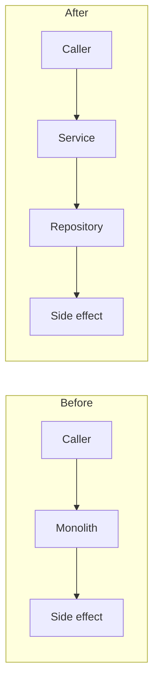

<!--
  TEMPLATE: Refactor / tech-debt / optimization changes doc
  =========================================================
  Copy this file to changes/<short-kebab-slug>.md and fill it in.
  Delete every <!-- ... --> guidance comment as you go.
  Strip any sections that genuinely do not apply.

  Naming: short kebab-case describing the refactor or perf win.
    Good: account-trigger-handler-extraction.md, hfn-creation-async-batch-migration.md
    Bad:  refactor1.md, cleanup.md, perf-fix.md
-->

# <Short title — what was refactored or optimized>

**Date:** YYYY-MM-DD
**Sandbox:** `<sandbox-alias>`
**Lead:** <Name> (<role>)
**Story / ticket:** [<TRACKER-NNN>](<url>) — <one-line summary> (or "internal tech-debt cleanup" if no ticket)
**Code commit(s):** [`<short-hash>`](#13-deploy-ids-and-commit-references) (latest; full list in section 13)
**Manifest:** [`manifest/<feature>.xml`](../manifest/<feature>.xml) (the deploy manifest used; XML inlined in section 13)
**Status:** Delivered / Functional parity verified, perf gain pending measurement / In progress

<!--
  **Code commit(s)** — singular hash for a one-shot refactor; comma-separated
  list when this thread iterated and the same doc grew over multiple commits
  (see the "Revision log" section below).

  **Manifest** — REQUIRED when the refactor involved `sf project deploy start
  --manifest <file>`. If you didn't use a manifest, write "n/a — used
  `--metadata` flags only" and list those flags in section 13.
-->

---

## 1. TL;DR + status

<!--
  3-6 sentences. Plain English. What was the technical problem, what's the new
  shape, what got measurably better, and what's left to verify in higher
  environments.

  If this thread spans multiple commits, this section describes the CUMULATIVE
  state of the refactor as of the latest commit — not just the latest patch.
-->

---

## 2. Revision log

<!--
  ONE row per code commit on this thread. New commits APPEND a row here
  rather than spawning a new doc. See `.cursor/rules/changes-doc-mandatory.mdc`
  "Same thread, same doc" for the rule.

  - For a one-shot refactor that ships in a single commit, this section is
    a one-row table — that's fine.
  - If an iteration superseded a previous approach, mark the older row
    "(superseded by <hash> — see row N)". Don't delete superseded rows.
-->

| # | Date (UTC) | Code commit | What was done | Why |
|---|---|---|---|---|
| 1 | YYYY-MM-DD HH:MM | [`<short-hash>`](#13-deploy-ids-and-commit-references) | <one-line plain English> | <initial refactor / follow-up callsite migration / perf-regression fix> |

---

## 3. Motivation — what was wrong

<!--
  Be specific about the pain. Avoid vague "code smell" language. Concrete
  examples of motivations:
    - "Same 80-line block of FLS-check logic copy-pasted across 7 controllers."
    - "Trigger handler runs 14 SOQL queries per record; bulk insert of 200 hits
      governor limits at row ~140."
    - "OmniScript's synchronous HFN creation step takes 18 seconds for a
      typical Par Form, blocking the user; needs to be async."
    - "DataRaptor returns nested JSON requiring 3 manual flatten steps in every
      caller."

  If a metric was measured, cite it (record IDs, log IDs, debug log lines).
-->

| Pain point | Concrete evidence |
|---|---|
| <one-line pain> | <metric / file / log id> |
| <one-line pain> | <metric / file / log id> |

---

## 4. Scope

<!--
  Crisp in/out lists. Refactors are notorious for creep — pin it down.
-->

### In scope

- <one-line item>
- <one-line item>

### Out of scope (explicitly)

- <one-line non-goal — note follow-up ticket if applicable>
- <one-line non-goal>

---

## 5. Before / after architecture



| Aspect | Before | After |
|---|---|---|
| <Aspect — e.g. number of classes> | <value> | <value> |
| <Aspect — e.g. SOQL queries per call> | <value> | <value> |
| <Aspect — e.g. file lines / cyclomatic> | <value> | <value> |
| <Aspect — e.g. coupling shape> | <description> | <description> |

---

## 6. Behavioral invariants preserved

<!--
  THE most important section of a refactor doc. The whole point of refactoring
  is "no behavior change" — prove it. List every observable behavior that must
  remain identical, and show how you confirmed each.

  If you intentionally changed any behavior (e.g. fixed a latent bug along the
  way), call it out separately so reviewers don't miss it.
-->

| Invariant | How preserved | Evidence |
|---|---|---|
| <e.g. "trigger fires before insert and before update only"> | <e.g. "kept BeforeInsert/BeforeUpdate context check in handler"> | <e.g. "TriggerHandlerTest.testContextRouting"> |
| <e.g. "AccountHistory entries written for X, Y, Z fields"> | <how> | <evidence> |

### Intentional behavior changes (if any)

<!--
  If you fixed a latent bug or removed a feature flag, note it here. Otherwise
  delete this subsection.
-->

| Behavior | Old | New | Why changed |
|---|---|---|---|
| <description> | <old> | <new> | <reason — link to bug ticket if applicable> |

---

## 7. Migration steps

<!--
  Only relevant if the refactor requires data migration, callout updates,
  custom-metadata changes, or any one-time operation. Skip otherwise.
-->

### One-time operations

| # | Step | Command / runbook | Reversible? |
|---|---|---|---|
| 1 | <e.g. "Backfill new field from formula"> | `<command>` | <yes/no> |
| 2 | <e.g. "Update Custom Metadata records to point at new endpoint"> | `<command>` | <yes/no> |

### Caller migration (if API surface changed)

<!--
  If you renamed/relocated a method or changed a signature, list every caller
  and confirm it was updated.
-->

| Caller | Path | Updated in this commit? |
|---|---|---|
| `<class>` | [`<path>`](<path>) | yes |
| `<class>` | [`<path>`](<path>) | yes |

---

## 8. Key changes — diff-style highlights

<!--
  Refactors are inherently large — even a "small" extraction touches many
  files. `git diff` rarely tells a reviewer "what's the point". Use this
  section to surface the meaningful before/after for the parts that aren't
  obvious from a callsite-by-callsite diff.

  Two patterns by change size:

  ▸ SMALL / MEDIUM change (the meaningful diff fits in ~30 lines):
    Paste the relevant snippet in a `diff` fence with a one-line
    commentary above it. Trim noise — only the lines that matter.

  ▸ LARGE change (new file, full rewrite, > ~100 lines):
    Cite line ranges + key method names. DO NOT paste a 500-line code dump.

  ▸ TRIVIAL change (1-2 line callsite update repeated across N files):
    Show ONE example diff and write "Same pattern applied to N callers — see commit `<hash>`".

  See `.cursor/rules/changes-doc-mandatory.mdc` "Diff-style highlights"
  for the full guidance.

  Add one sub-section per significant change. On iterative threads
  (multiple commits in this doc), each new commit gets a new sub-section
  here — do NOT overwrite the previous ones.
-->

### 8.1 — <component / file> — <one-line summary>

**File:** [`<path>`](<path>)
**Type of change:** Extracted / Inlined / Renamed / Rewritten
**Commit:** [`<short-hash>`](#13-deploy-ids-and-commit-references)

```diff
- <old line>
+ <new line>
```

### 8.2 — <component / file> — <one-line summary>

**File:** [`<path>`](<path>)
**Type of change:** Created (lines 1-N) / Whole-file rewrite
**Commit:** [`<short-hash>`](#13-deploy-ids-and-commit-references)

Whole file is too long to paste inline. Key sections:

- Lines 1-50: <description>
- Lines 51-180: <description of the meat>
- Lines 181-N: <description of the rest>

See commit `<short-hash>` for the full file.

---

## 9. Verification — functional parity

<!--
  Prove the refactor didn't break anything. Common approaches:
    - Run the full test suite (or a targeted subset) and show pass/fail counts
    - Compare snapshot outputs between old and new implementations
    - Run the same input through both and diff record counts/states
    - Spot-check critical user flows manually
-->

### Apex test results

```bash
sf apex run test --class-names <TestClass1>,<TestClass2> -o <sandbox-alias> \
  --synchronous --code-coverage --result-format human --wait 10
```

| Test class | Pass | Fail | Coverage % |
|---|---|---|---|
| `<TestClass>` | <count> | 0 | <percent>% |

### Side-by-side comparison (if possible)

| Input | Old output | New output | Match |
|---|---|---|---|
| <input description> | <output> | <output> | yes |
| <input description> | <output> | <output> | yes |

### Performance measurement (if perf-motivated)

<!--
  Cite the actual numbers. Apex log SOQL counts, batch elapsed time, OmniScript
  step duration — whatever metric the refactor was supposed to improve.
-->

| Metric | Before | After | Delta |
|---|---|---|---|
| <e.g. "SOQL queries per insert"> | <value> | <value> | <delta> |
| <e.g. "Apex CPU ms"> | <value> | <value> | <delta> |
| <e.g. "OmniScript step elapsed"> | <value> | <value> | <delta> |

---

## 10. Risk assessment

<!--
  Refactors are high-blast-radius by nature. Be honest about what could go
  wrong in higher environments. Reviewers will use this section to scope
  their review effort.
-->

| Risk | Likelihood | Impact | Mitigation |
|---|---|---|---|
| <e.g. "missed caller in another package"> | low/med/high | low/med/high | <e.g. "global search confirmed zero references"> |
| <e.g. "subtle semantics drift in null-handling"> | low/med/high | low/med/high | <e.g. "added test case TestX.testNullPath"> |

---

## 11. Untouched assets (explicit non-changes)

<!--
  Components in the refactor's adjacency that you intentionally did NOT touch,
  with a one-line reason. Helps reviewers understand the scope boundary.
-->

| Asset | Reason untouched |
|---|---|
| [`<path>`](<path>) | <one-line reason> |

---

## 12. Rollback procedures

### Full rollback (deploy required)

```bash
git checkout HEAD~1 -- force-app/main/default/<paths>

sf project deploy start \
  --metadata "<Type1>:<Name1>" \
  --metadata "<Type2>:<Name2>" \
  -o <sandbox-alias> --ignore-conflicts
```

### Migration rollback (if section 7 had any one-time ops)

| Migration step | Reversible? | Reversal command |
|---|---|---|
| <step from 6> | yes | `<command>` |
| <step from 6> | no | <explanation: e.g. "data backfilled, would need fresh dump from prod"> |

---

## 13. Deploy IDs and commit references

### Manifest used

<!--
  REQUIRED whenever the refactor involved `sf project deploy start
  --manifest`. Inline the FULL XML of the manifest below — reviewers
  shouldn't have to open another file to know what got deployed. The path
  link to the file is in the header block.

  If the deploy used `--metadata` flags only, write:
    "n/a — used `--metadata` flags only. Flags: `--metadata ApexClass:Foo
    --metadata CustomObject:Bar`."
-->

**Manifest path:** [`manifest/<feature>.xml`](../manifest/<feature>.xml)

```xml
<?xml version="1.0" encoding="UTF-8"?>
<Package xmlns="http://soap.sforce.com/2006/04/metadata">
    <types>
        <members><member-name></members>
        <name><MetadataType></name>
    </types>
    <version>66.0</version>
</Package>
```

### Deploys to `<sandbox-alias>`

| # | Deploy ID | Components | Time (UTC) | Code commit | Purpose |
|---|---|---|---|---|---|
| 1 | `0Af<...>` | <count> | YYYY-MM-DD HH:MM:SS | [`<short-hash>`](#) | <one-line purpose> |

<!--
  On iterative threads, add one row per code commit on the thread.
  Cross-reference the Revision log in §2.
-->

### Commit references

| Commit | What | When |
|---|---|---|
| **`<short-hash>`** (initial code change) | <one-line summary of all files in the commit> | YYYY-MM-DD |
| **`<short-hash>`** (this doc — initial) | `changes/<slug>.md` documenting the above | YYYY-MM-DD |

<!--
  On iterative threads, append rows here for every additional code/doc
  commit. Keep them paired and in chronological order.
-->

Confirm a commit:

```bash
git show --stat <short-hash>
```

---

## 14. Open follow-ups

<!--
  Numbered list. Concrete and actionable. Include perf-monitoring tasks,
  follow-up refactors, deletion of any deprecated-but-still-present code.
-->

1. <e.g. "Delete deprecated `OldHelper` class after one release of soak time in Prod.">
2. <e.g. "Apply same extraction pattern to `OtherTrigger` (follow-up story).">
3. <e.g. "Add Custom Metadata to expose the new flag in Setup for ops team.">
4. <e.g. "Update architecture doc at `<docs path>`.">
