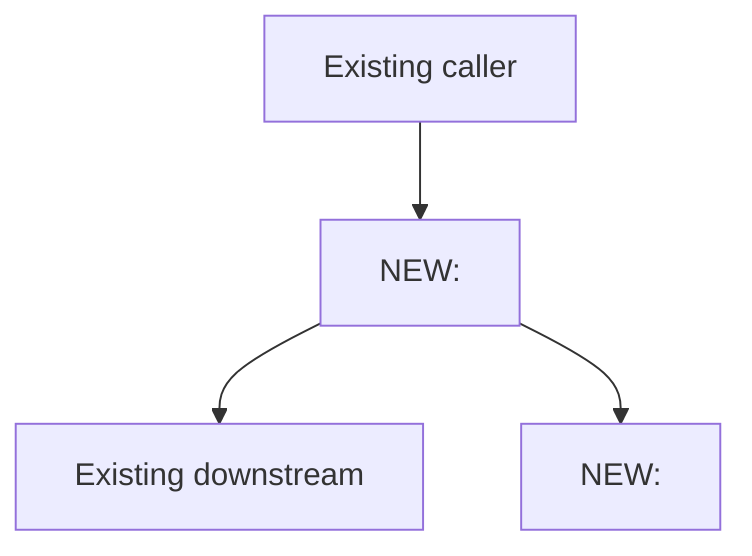

<!--
  TEMPLATE: Story / feature / requirement changes doc
  ===================================================
  Copy this file to changes/<short-kebab-slug>.md and fill it in.
  Delete every <!-- ... --> guidance comment as you go.
  Strip any sections that genuinely do not apply.

  Naming: short kebab-case describing the feature shipped.
    Good: add-bulk-import-omniscript.md, account-merge-button-on-vendor-layout.md
    Bad:  US-12345.md, story1.md, JIRA-feature.md

  Prerequisite: this doc is written at WRAP-UP, but §4 (Requirements) is filled
  from the INTAKE transcription you (or the agent) captured at work-start
  per `.cursor/rules/changes-doc-mandatory.mdc` "Intake protocol". If you
  skipped intake, go back and do it now — re-read the original AC source,
  transcribe to text, confirm with the user, THEN come back here.
-->

# <Short title — what was built>

**Date:** YYYY-MM-DD
**Sandbox:** `<sandbox-alias>`
**Lead:** <Name> (<role>)
**Story / ticket:** [<TRACKER-NNN>](<url>) — <one-line summary from the ticket>
**Code commit(s):** [`<short-hash>`](#13-deploy-ids-and-commit-references) (latest; full list in section 13)
**Manifest:** [`manifest/<feature>.xml`](../manifest/<feature>.xml) (the deploy manifest used; XML inlined in section 13)
**Status:** Delivered / Delivered to <sandbox-alias>, pending UAT / In progress

<!--
  **Code commit(s)** — singular hash for a one-shot story; comma-separated
  list when this thread iterated and the same doc grew over multiple commits
  (see the "Revision log" section below).

  **Manifest** — REQUIRED when the work involved `sf project deploy start
  --manifest <file>`. If you didn't use a manifest (e.g. metadata-flag based
  deploy only), write "n/a — used `--metadata` flags only" and list those
  flags in section 13.
-->

---

## 1. TL;DR + status

<!--
  3-6 sentences. Plain English. What does the user/business get out of this work,
  what did we build to deliver it, and what is verified vs. pending UAT or Prod
  promotion. No jargon without expansion.

  If this thread spans multiple commits, this section describes the CUMULATIVE
  state of the fix as of the latest commit — not just the latest patch.
-->

---

## 2. Revision log

<!--
  ONE row per code commit on this thread. New commits APPEND a row here
  rather than spawning a new doc. See `.cursor/rules/changes-doc-mandatory.mdc`
  "Same thread, same doc" for the rule.

  - "What was done" — one-line plain English.
  - "Why" — what surfaced the need for this iteration (initial requirement,
    QA finding, edge case discovered post-deploy, etc.).
  - For a one-shot story that ships in a single commit, this section is a
    one-row table — that's fine.
  - If an iteration superseded a previous approach, mark the older row
    "(superseded by <hash> — see row N)". Don't delete superseded rows.
-->

| # | Date (UTC) | Code commit | What was done | Why |
|---|---|---|---|---|
| 1 | YYYY-MM-DD HH:MM | [`<short-hash>`](#13-deploy-ids-and-commit-references) | <one-line plain English> | <ticket / QA finding / edge case discovered> |

---

## 3. Background / business context

<!--
  Why are we doing this? Who asked for it? What problem does the business hit
  today, and what does success look like for them?

  This section is the "Product" voice — explain it as you would to a stakeholder
  who has never seen the codebase.
-->

---

## 4. Requirements

<!--
  ▸ This section MUST be filled from the Step 0 intake transcription —
    the plain text you (or the agent) wrote down off the AC screenshot / ticket
    panel BEFORE writing any code. See `.cursor/rules/changes-doc-mandatory.mdc`
    "Intake protocol" for why screenshots alone are not acceptable.

  ▸ Rules:
    - Every row of "In scope" below is plain text. NEVER write "see attached
      screenshot" or "see ticket" — the AC text must be inline so the doc
      reads a year from now without Jira open.
    - Number them AC1, AC2, AC3, ... so §9 (Acceptance criteria + verification)
      can refer back unambiguously.
    - "Source" column points back to the original artefact (ticket URL,
      screenshot filename if you committed it under `docs/`, email date,
      Slack thread link, meeting note). The text content stays inline.
    - Out-of-scope items deserve an explicit list — prevents scope-creep
      arguments later. If the user didn't call any out at intake, the intake
      protocol required asking; either fill the list or write "n/a — none
      called out at intake on YYYY-MM-DD".
-->

### In scope

| # | Requirement (verbatim from intake transcription) | Source |
|---|---|---|
| AC1 | <one-line acceptance criterion — TEXT, NOT an image reference> | <ticket URL / `docs/<screenshot>.png` / email / Slack link / meeting note> |
| AC2 | <one-line acceptance criterion — TEXT, NOT an image reference> | <ticket URL / `docs/<screenshot>.png` / email / Slack link / meeting note> |
| AC3 | <one-line acceptance criterion — TEXT, NOT an image reference> | <ticket URL / `docs/<screenshot>.png` / email / Slack link / meeting note> |

### Out of scope (explicitly)

<!--
  Items the user explicitly called out as NOT part of this story (or, if you
  asked at intake and the answer was "nothing", write "n/a — confirmed no
  out-of-scope items at intake on YYYY-MM-DD").
-->

- <one-line non-goal>
- <one-line non-goal>

---

## 5. Design decisions

<!--
  For each non-obvious decision, document the alternatives you considered and why
  you picked the one you picked. Future-you (or your replacement) needs to be
  able to revisit these without re-running the analysis.

  ──────────────────────────────────────────────────────────────────────
  FILL UP FRONT (per `.cursor/rules/changes-doc-mandatory.mdc` Step E4)
  ──────────────────────────────────────────────────────────────────────
  Design decisions belong UP FRONT (after intake, before any code edit),
  not after-the-fact. Spawn the preliminary changes/<slug>.md as soon as
  intake closes. Each Step E3 ACCIDENTAL row that the user resolves into
  an INTENDED behavior becomes a row in this section — with the rejected
  alternatives listed honestly. Doing this after-the-fact gives you a
  doc full of "the choice was obvious" rationalizations; doing it before
  gives you a real decision record the next engineer can revisit.
-->

### 5.1 — <decision title>

**Decision:** <one paragraph stating the chosen approach>

**Alternatives considered:**

| Option | Pros | Cons | Why rejected |
|---|---|---|---|
| <Option A — chosen> | <pros> | <cons> | (chosen) |
| <Option B> | <pros> | <cons> | <reason> |
| <Option C> | <pros> | <cons> | <reason> |

### 5.2 — <decision title>

<!-- repeat -->

---

## 6. Architecture

<!--
  Diagram + table. The diagram should show the new component(s) in the context
  of the existing system, with the new pieces visually distinguished.

  ──────────────────────────────────────────────────────────────────────
  FILL UP FRONT (per `.cursor/rules/changes-doc-mandatory.mdc` Step E4)
  ──────────────────────────────────────────────────────────────────────
  The architecture diagram is the output of Step E2 (cascading-impact
  map) from the pre-coding analysis protocol. Draft it BEFORE any code
  is written so you can see the dependency chain and catch accidental
  side-effects in Step E3. At wrap-up, update if anything moved from
  the planned shape — but never wait until wrap-up to draw it for the
  first time. A diagram you draw from memory at wrap-up will be a
  cleaned-up rationalization; a diagram you draw before coding is
  evidence for the design decisions in §5 above.
-->



| Layer | Component | New / Modified / Untouched | Path |
|---|---|---|---|
| UI | <name> | New | [`<path>`](<path>) |
| Apex controller | <name> | New | [`<path>`](<path>) |
| Apex service | <name> | Modified | [`<path>`](<path>) |
| Data | <SObject>.<field> | New | [`<path>`](<path>) |
| Permissions | <PermissionSet> | Modified | [`<path>`](<path>) |
| Integration | <flow / IP / OmniScript> | New | [`<path>`](<path>) |

---

## 7. Implementation summary

<!--
  Per-component summary. One subsection per significant component. The reader
  should be able to skim this and know which file does what without opening any
  of them.
-->

### 7.1 — <Component name>

**Path:** [`<path>`](<path>)
**Purpose:** <one paragraph>
**Key methods/properties:** `<method1>`, `<method2>`
**Notable quirks:** <e.g. "uses `with sharing`", "runs in @future when called from trigger context", "respects `<custom metadata>` flag">

### 7.2 — <Component name>

<!-- repeat -->

### 7.N — Field metadata

<!-- For new custom fields: object, API name, type, constraints, FLS plan -->

| Object | Field API name | Type | Required | Default | Profiles/PermSets granted |
|---|---|---|---|---|---|
| `<SObject>` | `<API>` | <type> | <Y/N> | <value> | <list> |

---

## 8. Key changes — diff-style highlights

<!--
  `git diff` is the canonical source, but for several Salesforce metadata
  types it's unreadable — OmniScripts / IPs / DRs / FlexiPages / page layouts
  / validation rules / formula fields / new Apex classes all benefit from a
  human-readable diff in the doc itself.

  Two patterns by change size:

  ▸ SMALL / MEDIUM change (the meaningful diff fits in ~30 lines):
    Paste the relevant snippet in a `diff` fence with a one-line
    commentary above it. Trim noise — only the lines that matter.

  ▸ LARGE change (new file, full rewrite, > ~100 lines):
    Cite line ranges + key method/element names. DO NOT paste a
    500-line code dump.

  ▸ TRIVIAL change (1-2 lines plain Apex, git diff is already clean):
    A single line that says "see commit `<hash>` (1-line addition)" is
    enough — don't pad.

  See `.cursor/rules/changes-doc-mandatory.mdc` "Diff-style highlights"
  for the full guidance.

  Add one sub-section per significant change. On iterative threads
  (multiple commits in this doc), each new commit gets a new sub-section
  here — do NOT overwrite the previous ones.
-->

### 8.1 — <component / file> — <one-line summary>

**File:** [`<path>`](<path>)
**Type of change:** Created / Modified / Deleted
**Commit:** [`<short-hash>`](#13-deploy-ids-and-commit-references)

```diff
- <old line>
+ <new line>
```

### 8.2 — <component / file> — <one-line summary>

**File:** [`<path>`](<path>)
**Type of change:** Created (lines 1-348)
**Commit:** [`<short-hash>`](#13-deploy-ids-and-commit-references)

Whole file is too long to paste inline. Key sections:

- Lines 1-50: <description>
- Lines 51-180: <description of the meat>
- Lines 181-348: <description of the rest>

See commit `<short-hash>` for the full file.

---

## 9. Acceptance criteria + verification

<!--
  Walk through each AC from section 4 and prove it works. Be concrete: cite
  record IDs, screenshots (committed under docs/ if visual), Apex log Ids,
  query results.
-->

| AC | Verification approach | Evidence | Pass? |
|---|---|---|---|
| AC1 | <how it was tested> | <record id / log id / screenshot path> | yes |
| AC2 | <how it was tested> | <record id / log id / screenshot path> | yes |
| AC3 | <how it was tested> | <record id / log id / screenshot path> | yes |

---

## 10. Test coverage

### Apex tests

| Test class | Methods | Coverage % | Notes |
|---|---|---|---|
| `<TestClass>` | <count> | <percent>% | <one-line note> |

```bash
sf apex run test --class-names <TestClass> -o <sandbox-alias> \
  --synchronous --code-coverage --result-format human --wait 10
```

### Manual scenarios

| Scenario | Steps (or link to runbook) | Expected | Actual |
|---|---|---|---|
| <Scenario A> | <steps> | <expected> | <actual> |
| <Scenario B> | <steps> | <expected> | <actual> |

### Negative / edge cases

| Case | Behavior | Pass? |
|---|---|---|
| <e.g. user without permission> | <expected error or denial> | yes |
| <e.g. bulk insert of 200> | <governor-limit safety> | yes |

---

## 11. Untouched assets (explicit non-changes)

<!--
  Components in the same area that you intentionally did NOT modify, with a
  one-line reason each. Prevents "why didn't you also fix X?" review questions.
-->

| Asset | Reason untouched |
|---|---|
| [`<path>`](<path>) | <one-line reason — out of scope, will follow in story X, not affected by this work> |

---

## 12. Rollback / feature-flag plan

<!--
  Salesforce metadata is hard to "uninstall". Plan how this story can be turned
  off without a redeploy if it misbehaves in higher environments. Options:
    - Custom metadata feature flag (preferred)
    - Profile/PermissionSet revoke
    - Hide the UI (FlexiPage component visibility)
    - Deactivate the trigger / flow
    - Full git revert + redeploy (last resort)
-->

### Quick disable (no deploy)

<!-- e.g. "Toggle MyFeature__mdt.IsEnabled__c = false on the master record" -->

### Full rollback (deploy required)

```bash
git checkout HEAD~1 -- force-app/main/default/<paths>

sf project deploy start \
  --metadata "<Type1>:<Name1>" \
  --metadata "<Type2>:<Name2>" \
  -o <sandbox-alias> --ignore-conflicts
```

---

## 13. Deploy IDs and commit references

### Manifest used

<!--
  REQUIRED whenever the work involved `sf project deploy start --manifest`.
  Inline the FULL XML of the manifest below — reviewers shouldn't have to
  open another file to know exactly what got deployed. The path link to the
  file is in the header block.

  If the deploy used `--metadata` flags only (no manifest file), write:
    "n/a — used `--metadata` flags only. Flags: `--metadata ApexClass:Foo
    --metadata CustomObject:Bar`."
-->

**Manifest path:** [`manifest/<feature>.xml`](../manifest/<feature>.xml)

```xml
<?xml version="1.0" encoding="UTF-8"?>
<Package xmlns="http://soap.sforce.com/2006/04/metadata">
    <types>
        <members><member-name></members>
        <name><MetadataType></name>
    </types>
    <version>66.0</version>
</Package>
```

### Deploys to `<sandbox-alias>`

| # | Deploy ID | Components | Time (UTC) | Code commit | Purpose |
|---|---|---|---|---|---|
| 1 | `0Af<...>` | <count> | YYYY-MM-DD HH:MM:SS | [`<short-hash>`](#) | <one-line purpose> |

<!--
  On iterative threads, add one row per code commit on the thread.
  Cross-reference the Revision log in §2.
-->

### Commit references

| Commit | What | When |
|---|---|---|
| **`<short-hash>`** (initial code change) | <one-line summary of all files in the commit> | YYYY-MM-DD |
| **`<short-hash>`** (this doc — initial) | `changes/<slug>.md` documenting the above | YYYY-MM-DD |

<!--
  On iterative threads, append rows here for every additional code/doc
  commit. Keep them paired and in chronological order.
-->

Confirm a commit:

```bash
git show --stat <short-hash>
```

---

## 14. Open follow-ups

<!--
  Numbered list. Concrete and actionable. Include UAT/Prod promotion steps,
  follow-up stories, monitoring tasks.
-->

1. <e.g. "Promote to UAT after stakeholder sign-off on AC2 in `<sandbox-alias>`.">
2. <e.g. "Create follow-up story <TRACKER-NNN> for the out-of-scope item from section 4.">
3. <e.g. "Add monitoring on `<custom metadata>` flag toggle (AccountHistory tracking).">
4. <e.g. "Update user-facing runbook at `<docs path>`.">
