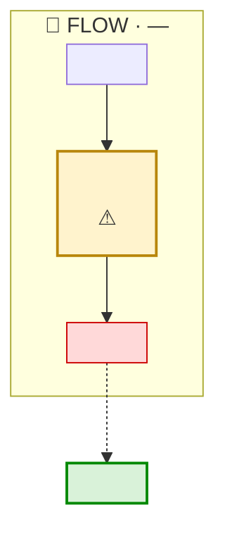

<!--
  TEMPLATE: Session walkthrough & decision capture
  ================================================
  Copy this file to docs/lld/<work-id>-walkthrough.md and fill it in.
  Delete guidance comments, but KEEP any adversarial Gate A/B content — it is
  the review's audit trail, not guidance.

  Use this for ANY alignment session — stakeholder / SME / business review OR a
  technical / design review — where you need to (a) share how something works
  today (reverse-KT) and (b) capture a small set of decisions before building.

  OPTIONAL: create it only when a live session + decision capture is actually
  warranted (see .cursor/rules/documentation-workflow.mdc). The full design lives in the LLD
  (<work-id>-<slug>.md); this doc is the meeting companion, kept deliberately
  short and plain-language.
-->

# <work-id> — Session walkthrough & decision capture

**Purpose:** Align on the problem, share how it works today (reverse-KT), and capture the decisions needed before building.
**Work item:** [<TRACKER-NNN>](<url>) — <one-line summary>
**Facilitator:** <Name> (<role>) · **Date:** ______ · **Attendees:** ______
**Suggested duration:** <e.g. 30 minutes>
**Backing detail:** LLD [`<work-id>-<slug>.md`](<work-id>-<slug>.md) · Questions/KT [`<work-id>-questions-and-kt.md`](<work-id>-questions-and-kt.md)

> Facilitator note: read §1-§4 aloud (~5 min), confirm the reverse-KT in §5 (~5 min), then spend the bulk of the time on §6 decisions. Most have a recommended default — for those you just need a "yes, go with default" or an adjustment. Capture outcomes in §7.

---

## 1. Why we are here (30 seconds)

<plain-language statement of the problem and why it matters to the audience.>

---

## 2. The problem in one picture

<!-- Follows docs/diagram-conventions.md, with one concession to the audience:
     this diagram is read live by people who did not open the metadata, so keep
     it to the fewest components that make the problem land. Everything else
     holds — one subgraph per component, legend above the fence, colour for
     state only, amber on the step that is wrong. -->

**Legend.** <only the symbols used> 🔷 Flow · 🟣 Apex · 📄 org data. Amber = where it goes wrong, green = the outcome we want.

<one-line real example, if available.>

---

## 3. How it works today (reverse-KT)

<!-- The few things the room must understand about CURRENT behavior, in plain
     language. Stating these surfaces wrong assumptions before any code. -->

- <fact 1 about current behavior.>
- <fact 2.>
- <the gap, in one line.>

---

## 4. What we will change (one paragraph)

<the proposed change in plain language; note if it is additive / low-risk.>

---

## 5. Please confirm we understood these correctly (quick yes/no)

- [ ] <reverse-KT statement 1.> | yes / no: ____
- [ ] <reverse-KT statement 2.> | yes / no: ____

---

## 6. Decisions we need (with recommended defaults)

<!-- Include unresolved adversarial-review findings only when a live decision
     is required. Cite finding ID/severity/evidence and record whether the
     decision fixes, accepts, or defers the risk. -->

> For each, the simplest path is to confirm the recommended default. Only the ones marked **needs input** are likely to need real discussion.

**D1 — <decision question>?** (maps to Q1)
- Recommended default: <default>.
- <**needs input** / confirm default?> -> Decision: ______

**D2 — <decision question>?** (maps to Q2)
- Recommended default: <default>. -> Decision: ______

---

## 7. Decision log (fill during the session)

| # / finding | Severity | Evidence | Recommended default | Final decision | Approver / owner | Date | Status |
|---|---|---|---|---|---|---|---|
| D1 / `<AR-A-001>` | <severity> | <path/query/risk> | <default> | | | YYYY-MM-DD | Open / Decided |
| D2 | <severity/N/A> | <evidence> | <default> | | | YYYY-MM-DD | Open / Decided |

---

## 8. Out of scope / related work

- <related / sibling work handled elsewhere.>

---

## 9. Next steps after the session

1. Update the LLD with every decision that changes assumptions, scope, ACs, or design.
2. Treat the updated LLD as a new revision and rerun the Gate A critics against it; do not build on the pre-session verdict.
3. After Gate A passes, <reproduce / implement / verify>.
4. <coordinate sequencing with related work, if any.>
