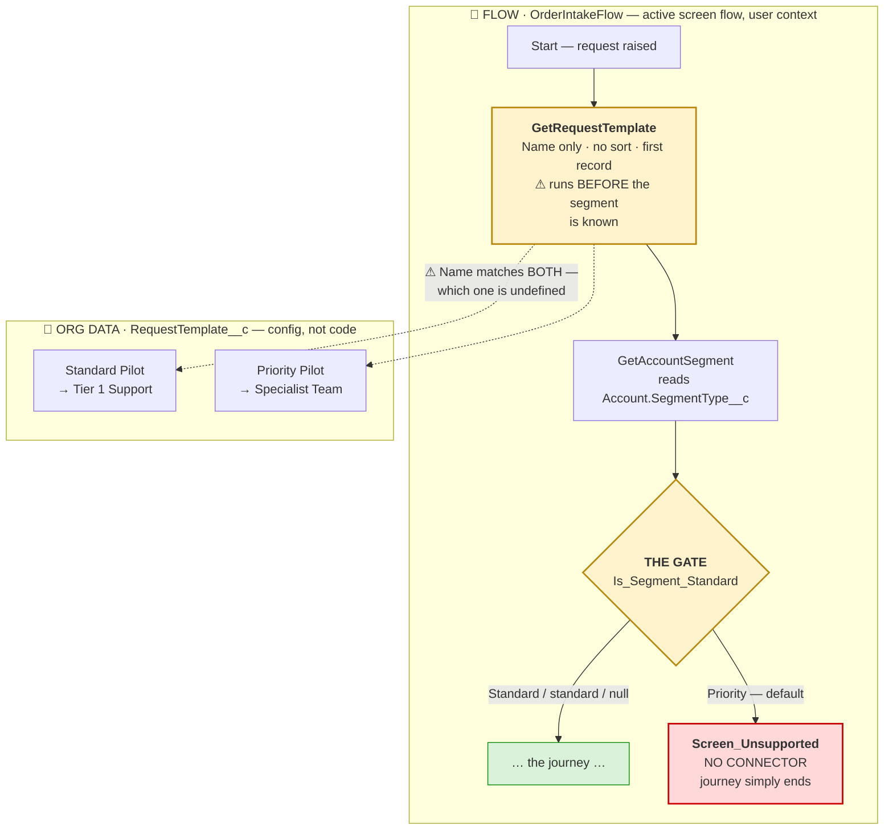
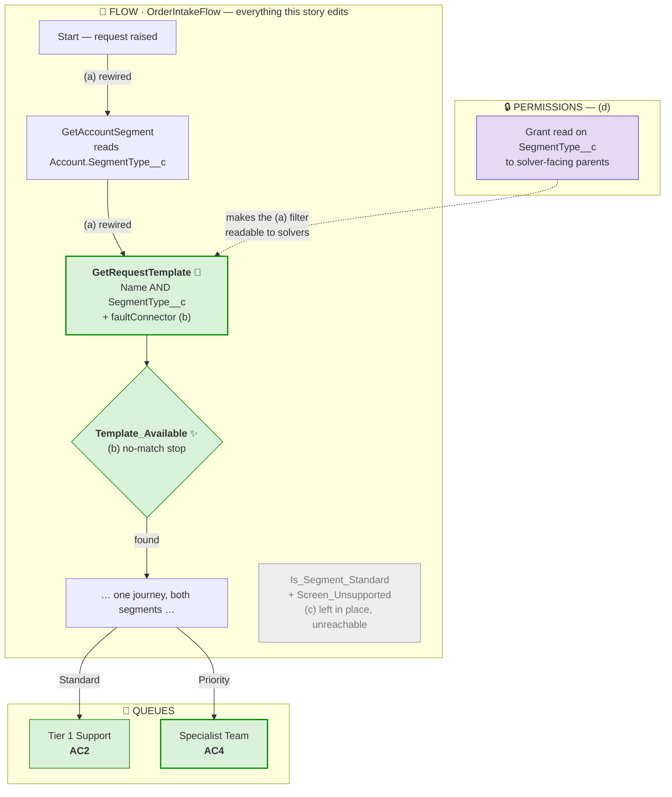

# Diagram conventions — component-scoped mermaid flowcharts

How to draw the flowcharts in an LLD or a change doc so a reader who has never opened the metadata can tell, at a glance, **which component each step lives in** and **which step is the problem**.

A generic box-and-arrow diagram does not do that. It shows the happy path and hides the thing that matters: that step 3 is a different Flow owned by another team, that step 5 is static text in an LWC with no logic in it, and that step 4 is where the defect is. These conventions exist to put that information in the picture.

> **Where they apply:** the current-behaviour and proposed-design diagrams in [`docs/_templates/_TEMPLATE_lld.md`](_templates/_TEMPLATE_lld.md), the architecture diagrams in `changes/_templates/`, and the partial AC visual-delta diagrams that link change docs to step-by-step test evidence. Invoked by [`.cursor/rules/documentation-workflow.mdc`](../.cursor/rules/documentation-workflow.mdc) step E2.

---

## The one rule everything else follows

**One `subgraph` is one component.** Not one logical phase, not one swimlane, not one team — one deployable thing with a name you could put in a manifest.

That is what makes the diagram answer the question a reviewer actually has: *how many separate things does this change touch, and who owns them?* A diagram whose subgraphs are "Validation", "Processing", "Notification" tells you nothing about blast radius. A diagram whose subgraphs are one Flow, one LWC, one Apex class, and one custom object tells you the change spans four components and which of them are yours.

Label every subgraph as `<emoji> <TYPE> · <ComponentName> — <one-line role>`:

```
subgraph F1["🔷 FLOW · OrderIntakeFlow — active screen flow, user context"]
subgraph D1["📄 ORG DATA · RequestTemplate__c — config, not code"]
subgraph S1["🟢 LWC · requestFormRenderer → 🟣 APEX · RequestFormController"]
```

The trailing role clause is doing real work. "config, not code" tells a reader those rows change without a deploy. "user context" tells them sharing rules apply. "static text, no logic" pre-empts the question of whether a bug could live there. Write the clause that stops the reader having to ask.

Two components that are only ever touched together — an LWC and the controller it calls — may share one subgraph with a `→` between them, as above. Do not merge anything else.

## The legend is mandatory

Every diagram gets a legend line **immediately above the fence**, not in a caption below and not in a separate section. A reader meets the emoji before the diagram, or the diagram is decoration.

```markdown
**Legend — every dashed box is one component.** 🔷 this Flow · 🔶 a different Flow · 🟢 LWC renderer · 🟠 LWC static text · 🟣 Apex · 📄 org data (config, not code) · 🔒 permissions · 👥 queue. Green = working, amber = the problem, red = dead end.
```

Include only the symbols that diagram actually uses. A legend listing eight component types for a three-component diagram is noise.

When the diagram shows a *proposed* design, extend the legend with the change markers:

```markdown
**Legend.** 🔷 this Flow · 🟢 LWC renderer · 🟣 Apex · 📄 org data · 🔒 permissions · 👥 queue. Markers: ✨ new element · 🔧 modified · ♻️ existing, reused · grey = left unreachable.
```

## Component vocabulary

| Symbol | Component | Use it for |
|---|---|---|
| 🔷 | **This** Flow | The flow the story edits — the one under review |
| 🔶 | A **different** Flow | Another flow in the chain; someone else's surface |
| 🟢 | LWC renderer | A component with logic, wired to Apex or data |
| 🟠 | LWC static text | Screens and messages with no logic — nothing can break here |
| 🟣 | Apex | Class, trigger, controller, invocable |
| 📄 | Org data | Custom-object rows, custom metadata, config that changes without a deploy |
| 🔒 | Permissions | Permission sets, profiles, FLS, sharing |
| 👥 | Queue / group | Routing destinations, owners |
| ⚙️ | Integration | Named credential, external service, platform event |
| 🔁 | Async | Batch, queueable, scheduled, future |

Add a symbol only when a diagram genuinely needs a distinction this table lacks, and then add it to this table so the next diagram uses the same one. Consistency across documents is the point.

## Change markers

These go **inside the node label**, so the marker travels with the element:

| Marker | Meaning |
|---|---|
| ✨ | New element this change adds |
| 🔧 | Existing element this change modifies |
| ♻️ | Existing element reused as-is — no edit, but load-bearing |
| ⚠ | The defect, or the risk being called out |
| ⇄ | A loop pair (a loop element and the element it repeats) |

`♻️` earns its place: it is how a reader learns that a screen or class the design depends on is *not* being changed, which is the difference between "we reused the existing message" and "we need a new message".

## Colour palette

Colour is the fastest signal on the page, so it carries exactly one meaning: **state**, never component type. Component type is the emoji's job.

| State | `style` declaration |
|---|---|
| Working / correct / the goal | `fill:#d9f2d9,stroke:#080` |
| The problem | `fill:#fff3cd,stroke:#b8860b,stroke-width:2px` |
| Dead end / hard failure | `fill:#ffd9d9,stroke:#c00,stroke-width:2px` |
| Permissions | `fill:#e6d9f2,stroke:#63c` |
| Static text / no-logic screen | `fill:#ffe6cc,stroke:#d79b00` |
| Left unreachable, deliberately | `fill:#eeeeee,stroke:#999,color:#777` |
| Other inbound path, for context | `fill:#d9e8ff,stroke:#36c` |

Add `stroke-width:2px` to the two or three nodes a reader must not miss — the defect, and the nodes that satisfy an acceptance criterion. Applying it everywhere is the same as applying it nowhere.

```
style GFT fill:#fff3cd,stroke:#b8860b,stroke-width:2px
style DEAD fill:#ffd9d9,stroke:#c00,stroke-width:2px
style J fill:#d9f2d9,stroke:#080
```

When the same colour repeats across more than about four nodes, declare it once and assign it, which also makes a palette change a one-line edit:

```
classDef ok fill:#d9f2d9,stroke:#080
class GFT,IDS,LP,GHC,FTA ok
```

**Never let colour be the only carrier of meaning.** It disappears in dark mode, in print, and for a colour-blind reader. Every coloured node must also say what it is — through the emoji, a marker, or the label text. The palette is an accelerator on top of a diagram that already reads in black and white.

## Node and edge grammar

**Shapes.** `["..."]` is a step or element; `{"..."}` is a decision. Quote every label so mermaid tolerates `·`, `/`, `(`, and HTML.

**Labels carry the diagnosis, not just the name.** A node reading `GetRequestTemplate` is a table of contents. A node reading

```
["<b>GetRequestTemplate</b><br/>Name only · no sort · first record<br/>⚠ runs BEFORE the segment<br/>is known"]
```

is the finding. Use `<b>` on the element the reader must notice and `<br/>` to stack the *why* underneath the name. Keep each line short; mermaid does not wrap.

**Edges.** Solid `-->` is control flow — the interview, the transaction, the call. Dotted `-.->` is a data or reference relationship, and it needs a label saying what the relationship is:

```
GFT -.->|"⚠ Name matches BOTH —<br/>which one is undefined"| T1
PERM -.->|"makes the filter<br/>readable to solvers"| GFT
```

**Quote real values on decision edges.** `-->|"Credit / credit / null"|` is checkable against the metadata; `-->|yes|` is not. When a design is lettered in the prose, label the edges it rewires with the same letters — `-->|"(a) rewired"|` — so the diagram and the design section index each other.

**Keep line numbers out of the diagram.** They belong in the prose beside it (`Lines <n>-<m>: filters on Name only, no sortField, no faultConnector.`), where they can be updated without touching the picture.

## Draw the pair, and keep the node IDs stable

An LLD carries two diagrams: **current behaviour** in the current-behaviour section, and **where it plugs in** in the proposed-design section.

Give the same element the same node ID in both. Then a reader can hold them side by side and see precisely what moved, because the amber node in the first diagram is the green node in the second and the eye tracks it. Renaming IDs between the two throws away most of the value of drawing them both.

- The **current** diagram colours the defect amber and any dead end red, and its labels say what is wrong.
- The **proposed** diagram marks elements `✨`/`🔧`/`♻️`, greys out anything deliberately left unreachable, and its labels say what each element now does.

Anything the change leaves in place but strands should appear in the proposed diagram in grey rather than vanish. A component silently disappearing between the two diagrams reads as an oversight; grey with a note reads as a decision.

## Partial diagrams in acceptance-criteria evidence

A change doc must include a small `### Acceptance-criteria visual delta` excerpt beside real before/current screenshots for every visually observable AC. It is a traceability aid, not a third architecture diagram.

For each visually observable AC:

1. Add stable `<scenario-anchor>-visual-delta` and `<scenario-anchor>-test` anchors, then link directly to the matching checklist and back from the guide; also link to the full LLD diagram.
2. Use two separate Mermaid fences: **Before excerpt** and **Current excerpt**. Never create `BEFORE` / `AFTER` state subgraphs.
3. Select only the nodes needed to explain the AC, but keep each node inside its owning component subgraph.
4. Reuse the full LLD's node IDs where those nodes are shown, and keep IDs identical across the excerpt pair.
5. Retain an unchanged entry/context node so the excerpt's boundary is explicit; do not imply the excerpt is the whole runtime path.
6. Quote real predicate values and label dotted data/reference edges.
7. Keep stranded elements grey in the current excerpt. A component genuinely deleted by the implementation may appear only in the Before excerpt; say it was deleted in the prose.
8. Put the legend immediately above each fence and caption screenshots with environment, record ID/label, and observed value.

If runtime-before evidence is unsafe or no longer available, write `source-backed baseline only`; never fabricate a screenshot. For a data-only AC, skip Mermaid and point to query/log evidence. A visually observable one-component AC still gets the paired partial excerpt; the component subgraph makes that ownership explicit.

## When not to draw one

For full LLD/change-doc architecture diagrams, skip the diagram when the change is inside one component with no cascade — a single-method fix, a label change, or a formula correction. This exception does not apply to the required partial before/current excerpt for a visually observable AC.

Draw one when any of these is true, which is most non-trivial Salesforce work:

- The path crosses more than one component.
- Anything is nondeterministic, conditional, or has a dead end.
- Ownership is mixed — some components are yours and some are not.
- A reviewer would otherwise have to open three files to follow the sequence.

## Anti-patterns

- Subgraphs that are logical phases rather than named components, which hides blast radius — the failure these conventions exist to prevent.
- A legend below the diagram, in another section, or missing.
- Colour as the only signal, so the diagram is unreadable in dark mode or print.
- Colour used for component type instead of state, which collides with the emoji.
- Node labels that restate the element name and nothing else.
- Unlabelled dotted edges, leaving the reader to guess whether it is a call, a read, or a reference.
- `-->|yes|` where the real predicate value was available.
- Node IDs renamed between the current and proposed diagrams.
- `BEFORE` / `AFTER` / AC-number subgraphs, which group by state or requirement instead of deployable component.
- A partial AC excerpt presented as the complete architecture, or with no link to the full LLD.
- A reconstructed/mock image labelled as a real before screenshot.
- `stroke-width:2px` on every node, which emphasises nothing.
- A full architecture diagram for a single-component/no-cascade change; paired visual-AC excerpts are the explicit exception.

## Worked example

Current behaviour — the defect in amber, the dead end in red:

**Legend — every dashed box is one component.** 🔷 this Flow · 📄 org data (config, not code) · 👥 queue. Green = working, amber = the problem, red = dead end.



Proposed design — same node IDs, markers on what changed, the retired gate greyed rather than deleted:

**Legend.** 🔷 this Flow · 📄 org data · 🔒 permissions · 👥 queue. Markers: ✨ new element · 🔧 modified · grey = left unreachable.



Component and field names above are placeholders. Substitute your own; never carry another project's names into your diagram.
