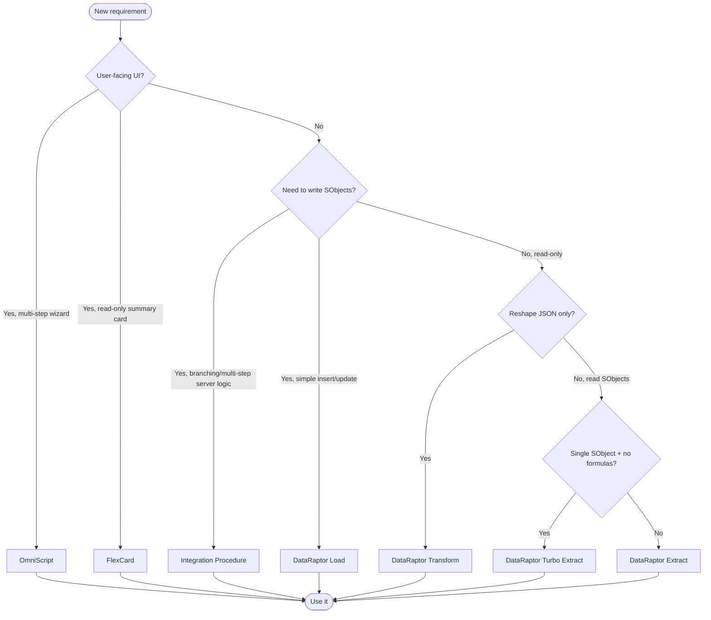
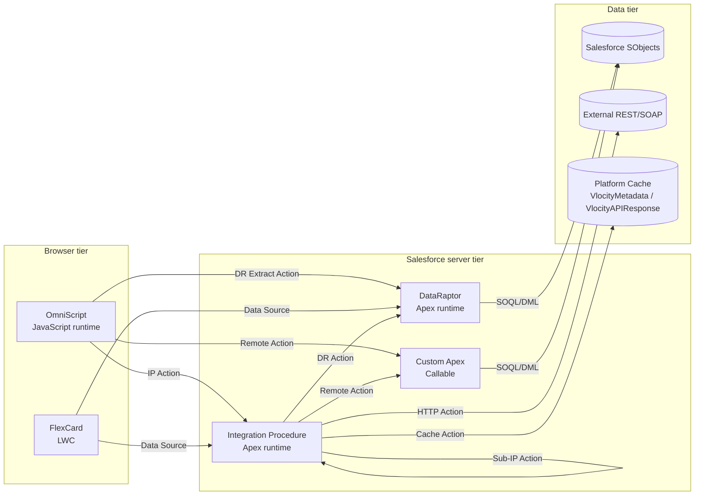

# OmniStudio Reference Guide

A vendor-neutral, opinionated reference for working with Salesforce **OmniStudio** — the declarative process automation toolkit that ships as part of Industries Cloud / Vlocity. This guide synthesizes Salesforce help docs, community write-ups (notably [ApexHours – Integration Procedure Basics](https://www.apexhours.com/integration-procedure-basics/)), and the [Salesforce OmniStudio Foundation YouTube playlist](https://www.youtube.com/playlist?list=PLSVJExRWWoctYZ14Z-r4Isl_oGKDdQDYi) into one place.

If you are working specifically on the {{ORG_NAME}} org, also read [`org-conventions.md`](org-conventions.md) for {{ORG_NAME}}-only naming conventions, deploy guardrails, and pointers to the Apex/data-model rules that drive every credentialing flow.

---

## What is OmniStudio?

OmniStudio is a low-code suite that lets you build guided processes, server-side orchestration, and Salesforce-aware data mapping declaratively. It has four headline tools:

| Tool | Purpose | Runtime | Persists? |
|------|---------|---------|-----------|
| **OmniScript** | Multi-step guided UI (forms, wizards, applications) | Browser (JavaScript) | UI session only |
| **Integration Procedure (IP)** | Server-side orchestration and integration with no UI | Salesforce server (Apex) | Per-call only |
| **DataRaptor / Data Mapper (DR)** | Declarative read/write/transform of Salesforce data | Salesforce server (Apex) | Reads or writes SObjects |
| **FlexCard** | Read-only Lightning card visualizations | Browser (Lightning Web Component) | UI session only |

Most non-trivial OmniStudio applications stitch all four together: a **FlexCard** previews data, the user clicks into an **OmniScript** to make changes, the OmniScript invokes an **IP** to orchestrate work, and the IP delegates to **DataRaptors** (and sometimes Apex) for the actual reads and writes.

This guide covers the first three in depth and only mentions FlexCards in passing — they have their own substantial documentation in Salesforce Help, and they generally consume rather than produce data.

### Two runtimes: Managed-Package vs Standard

OmniStudio currently ships in two flavors. Knowing which one your org runs matters for deployment, namespace handling, and CLI tooling:

| | Managed-Package Runtime (Vlocity) | Standard Runtime (core OmniStudio) |
|---|------------------------------------|-------------------------------------|
| Namespace | `vlocity_cmt__` (or `vlocity_ins__`, `vlocity_pa__`, etc.) | None |
| Storage | Custom objects (`vlocity_cmt__OmniScript__c`) | Standard objects (`OmniProcess`, `OmniUICard`) |
| Metadata type | DataPacks via Vlocity Build Tool | `OmniProcess`, `OmniDataTransform`, etc. via Salesforce CLI |
| Status | Legacy; under migration | Strategic; recommended for new builds |

Salesforce provides the **OmniStudio Migration Assistant** (a `sf` CLI plugin) to move from managed-package to Standard Runtime. Run it in `Assess` mode before `Migrate` mode — the assessment identifies unsupported components (custom Angular elements, deprecated formulas, etc.) that need manual rework first. See [`patterns.md` § Deployment caveats](patterns.md#deployment-caveats) for the deployment-path differences.

The rest of this guide applies to both runtimes; deviations are called out where they matter.

---

## Pick the right tool

Use this decision tree any time you're about to add a new piece of OmniStudio metadata:

**Rules of thumb:**

- If two valid tools fit, pick the **simpler / faster** one. A DataRaptor Turbo Extract beats a custom Apex method beats an Integration Procedure for the same single-object read.
- Reach for **Apex** only when OmniStudio cannot express the logic — for example: regex with backreferences, complex date-arithmetic in IP context, schema introspection, or external HTTP retries.
- Never put heavy business logic inside an OmniScript. The browser is the worst place to run it (see "Server-side first" below).

---

## Tier architecture

OmniStudio runs across three tiers. Each tier has a different runtime, different limits, and different formula behavior. Mixing them up is the single most common cause of silent failures.

Each arrow in the diagram is a network round-trip from the browser, or an Apex call inside the server. The fewer of those, the better the user experience and the less you fight governor limits.

---

## Server-side first

OmniStudio's most important architectural principle:

> **Move work off the browser.** Anything that does not need to render or react in real time belongs in an Integration Procedure.

Why:

1. **Round trips are expensive.** Every OmniScript Action element is a network call. Five small Actions take ~5x as long as one IP Action that returns the same data.
2. **The OmniScript formula engine is anemic.** It is a JavaScript-based subset that lacks list/array primitives like `FILTER`, `LISTSIZE`, `VLOOKUP`, `SORTBY`, and the Apex bridge `FUNCTION`. See [`formulas.md`](formulas.md) for the full exclusivity matrix.
3. **The server can cache.** Use the `Cache Action` (or `useCache=true` on Remote/Apex actions) to memoize anything that doesn't change per request.
4. **The server can chain.** Long-running IPs can opt into chainable execution to bypass per-transaction governor limits without the user noticing.
5. **Trim the response.** A 1 MB JSON sent to the browser is wasted bandwidth and a parse-time tax on every step transition. IPs let you set `responseJSONNode` / `responseJSONPath` / `additionalOutput` to return only what the next OmniScript step needs.

Concretely: an OmniScript should call **one** Integration Procedure per Step (not three Remote Actions and a DR Extract). The IP composes whatever sub-IPs, DRs, and Apex calls it needs and returns a single, trimmed JSON.

---

## Directory contents

| File | Read this when… |
|------|-----------------|
| [`omniscripts.md`](omniscripts.md) | Building or modifying an OmniScript — element catalog, merge fields, design patterns, and pitfalls |
| [`integration-procedures.md`](integration-procedures.md) | Building or modifying an Integration Procedure — action catalog, async modes, `propertySetConfig` cheat sheet, best practices |
| [`dataraptors.md`](dataraptors.md) | Choosing between Turbo Extract / Extract / Transform / Load, or debugging an existing DR |
| [`formulas.md`](formulas.md) | Writing a formula in any tier — full function reference and the exclusivity matrix (which functions work where) |
| [`patterns.md`](patterns.md) | Architecting a new flow — composition, performance, governor limits, debugging, anti-patterns |
| [`org-conventions.md`](org-conventions.md) | Working in this org specifically — naming, deploy guardrails, links into `.cursor/rules/` and `docs/flows/` |

---

## External references

- Salesforce Help: [OmniScript Functions](https://help.salesforce.com/s/articleView?id=xcloud.os_omniscript_functions.htm&type=5)
- Salesforce Help: [Function Reference](https://help.salesforce.com/s/articleView?id=xcloud.os_function_reference.htm&type=5)
- ApexHours: [Integration Procedure Basics](https://www.apexhours.com/integration-procedure-basics/)
- YouTube: [Salesforce OmniStudio Foundation playlist](https://www.youtube.com/playlist?list=PLSVJExRWWoctYZ14Z-r4Isl_oGKDdQDYi)
- Trailhead: [OmniStudio Fundamentals](https://trailhead.salesforce.com/content/learn/modules/omnistudio-omniscript-fundamentals)
