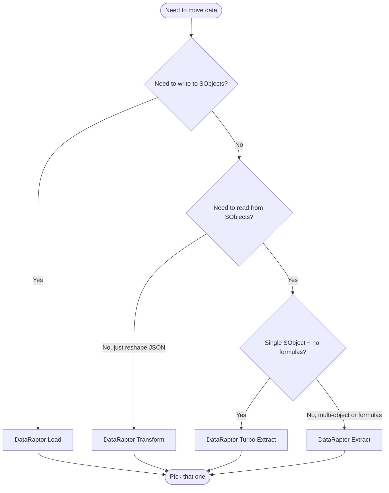

# DataRaptors / Data Mappers

DataRaptors (DRs) — also known as **Data Mappers** in the modern OmniStudio branding — are the declarative bridge between OmniStudio's JSON-shaped world and Salesforce's SObject-shaped world. They run on the server, in the Apex runtime, and there are exactly four kinds:

| Type | Reads SObjects? | Writes SObjects? | Formulas? | Use for |
|------|-----------------|-------------------|-----------|---------|
| **Turbo Extract** | ✅ Single | ❌ | ❌ | Single-object reads — the fastest tier-2 read |
| **Extract** | ✅ Multi | ❌ | ✅ | Multi-object reads, complex output JSON shaping |
| **Transform** | ❌ | ❌ | ✅ | Pure JSON↔JSON / JSON↔XML reshaping, no I/O |
| **Load** | ❌ | ✅ | ✅ | Insert / update / upsert SObjects |

> **TL;DR:** Turbo Extract for 90% of reads, Extract for the other 10%, Transform when you need to reshape without touching the database, Load whenever you write.

DataRaptors are stored as `.rpt-meta.xml` files under `force-app/main/default/omniDataTransforms/`. Despite the directory name, every DR — read, write, transform — lives there.

---

## Decision tree

Use this any time you reach for a DataRaptor:



---

## Turbo Extract

**Single SObject, no formulas, fastest read.** Reach for this first when you need to read.

### What it can do

- Query a single SObject (with related-object fields via standard SOQL relationship traversal: `Account.Owner.Name`).
- Filter with input parameters (`Id = :inputId`).
- Limit, sort, and paginate.
- Output to JSON, XML, or custom formats.
- Take advantage of the optimized Turbo execution path — bypasses the formula engine entirely.

### What it cannot do

- Use formulas anywhere in the mapping.
- Query multiple unrelated SObjects.
- Mask data via formulas.
- Compute derived columns.

### Configuration outline

```text
Type: Extract
Variant: Turbo
Source SObject: Account
Filter: Id = :ContextId
Output Type: JSON
Output Mappings:
  Account.Id          -> Account.Id
  Account.Name        -> Account.Name
  Account.Owner.Name  -> Account.OwnerName
  Account.PRM_Stage__c -> Account.Stage
```

The mapping table is the entire definition. There's no transform layer, which is exactly why it's fast.

### When you discover you need formulas

If you're halfway through configuring a Turbo Extract and realize you need a formula (e.g. concatenate FirstName and LastName, derive a status), don't add formulas — Turbo Extract silently ignores them. Switch the variant to **Extract** instead.

---

## Extract

**Multi-object reads, formulas allowed, complex JSON shaping.** Use this when Turbo Extract isn't enough.

### What it can do

- Everything Turbo Extract can do, plus:
- Query multiple SObjects (joined or independent).
- Use formulas in output mappings (compute, mask, format).
- Build deeply nested output JSON.
- Convert output to JSON, XML, custom format, or CSV.
- Apply input parameter transformations before the SOQL.

### What it cannot do

- Insert/update/delete (use Load).
- Bypass the formula engine cost (use Turbo Extract if you don't need formulas).

### Configuration outline

```text
Type: Extract
Variant: standard
Sources:
  Source 1: Account WHERE Id = :ContextId
  Source 2: Contact WHERE AccountId = :ContextId
  Source 3: Opportunity WHERE AccountId = :ContextId
Output Type: JSON
Output Mappings:
  Account.Id                  -> Account.Id
  Account.Name                -> Account.Name
  CONCAT(Account.FirstName,
         " ",
         Account.LastName)    -> Account.FullName
  Contact[*].Id               -> Contacts[].Id
  Contact[*].Name             -> Contacts[].Name
  Opportunity[*].Amount       -> Opportunities[].Amount
  SUM(Opportunity[*].Amount)  -> TotalOpportunityValue
```

The `[*]` and `[]` syntax expresses arrays — `Contact[*]` reads every Contact row, `Contacts[]` projects them as an array under `Contacts` in the output JSON.

### Performance considerations

Extract DRs are slower than Turbo Extracts because they go through the formula engine even when no formulas are present. If your Extract has no formulas and reads a single object, convert it to a Turbo Extract.

---

## Transform

**No DB I/O, just reshape data.** Use when you have JSON in hand and want different JSON out.

### What it can do

- Reshape JSON: rename keys, restructure, flatten, denormalize.
- Convert formats: JSON ↔ XML, JSON → CSV.
- Apply formulas at any mapping point.
- Run in OmniScripts, IPs, or Apex.

### What it cannot do

- Read from or write to Salesforce. (For that, chain a Transform after an Extract or before a Load.)
- Anything Apex-specific (no `FUNCTION()` calls in pure Transform — though IP context allows them via the IP itself).

### Common Transform use cases

- Reshape an OmniScript's data JSON before sending to a Load DR.
- Wrap an HTTP API response in the schema your OmniScript expects.
- Strip sensitive fields before logging.
- Convert a JSON list to XML for a SOAP integration.

### Configuration outline

```text
Type: Transform
Input: Whatever JSON you pass in
Output Mappings:
  Account.Name                -> output.accountName
  CONCAT(FirstName, LastName) -> output.fullName
  IF(Status == "Active",
     "Y", "N")                -> output.isActive
  Contact[*].Email            -> output.emails[]
```

Transform DRs are the workhorse for "this OmniScript's data shape doesn't match this DR Load's input shape" problems. Spend a Transform; it's cheap.

---

## Load

**Writes to SObjects.** This is the only DR type that performs DML.

### What it can do

- Insert new SObjects.
- Update existing SObjects (by Id or external Id).
- Upsert (insert or update based on key).
- Use formulas in input mappings.
- Use attributes — special handling for `Id`, `RecordTypeId`, person account `IsPersonAccount`, etc.
- Migrate CSV data (with the right input adapter).

### What it cannot do

- Delete records (DR has no Delete variant — use Apex via Remote Action, or a flow).
- Bulkify in interesting ways beyond what the underlying DML can do.
- Skip validation rules / triggers / flows. **Loads run all server-side automation.** Plan accordingly.

### Configuration outline

```text
Type: Load
Output SObject: Account
Operation: Upsert
Operation Key: Id (or external id field)
Input Mappings:
  input.accountName                  -> Account.Name
  input.firstName                    -> Account.FirstName
  IF(input.isPerson, true, false)    -> Account.IsPersonAccount
  TODAY()                            -> Account.LastReviewDate__c
```

For multi-object writes, configure multiple output SObjects with their own mapping blocks. Specify the **Order of Execution** so parents are inserted before children — relationship fields can reference the freshly-inserted parent's `Id`.

### Common Load gotchas

- **Validation rules fire.** Anything you'd normally trigger via the Salesforce UI fires here. Always include the validation-driving fields in the mapping.
- **Required fields.** Missing required fields fail silently in some DR configurations. Inspect the response.
- **Bulk DML limits.** Loads aggregate input rows into one DML per object. If you're loading 200+ records, watch the per-transaction DML row limit.
- **Master-Detail vs Lookup.** A Master-Detail child can't be inserted before its parent exists. Get the order right.
- **Upsert key must be unique.** Configuring a non-unique field as the Upsert Key causes "multiple records found" errors at runtime. Use `Id`, an External ID with the Unique flag set, or the standard `Id` field for self-upsert. If you mark a custom field as External ID, also mark it as Unique — Salesforce doesn't enforce uniqueness from the External ID flag alone.
- **Duplicate external IDs in one batch fail the whole batch.** When the input array contains two rows with the same External ID, Salesforce rejects the entire batch (default size 200) with a "Duplicate External IDs" error. To process duplicates, either de-duplicate upstream in a Transform DR, or set the Load batch size to 1 (slow but reliable).
- **Multiple existing records share the same External ID.** Even if you upsert one new record, if two rows in the database already share the upsert-key value, the operation fails — Salesforce requires exactly 0 (insert) or 1 (update) match. This usually points to a data-integrity bug; clean it up in Apex or via Data Loader before retrying.
- **Person Account writes need `IsPersonAccount` and the right RecordType.** A Load that creates Person Accounts must explicitly set `IsPersonAccount = true` and a Person Account record type, or the write silently creates a Business Account.
- **Trigger order matters.** Loads run all triggers, flows, and process builders. If a downstream trigger expects fields that the Load hasn't written yet (because a Pre-Transform DR didn't populate them), the trigger sees null. Inspect trigger order before assuming a Load + trigger combo will work.

---

## Common DR properties

These properties exist across multiple types.

| Property | Where it applies | What it does |
|----------|------------------|--------------|
| **Bundle Name** | All | The DR's API name. Referenced by Action elements. |
| **Type** | All | Extract / Transform / Load. |
| **Variant** | Extract | Turbo or standard. |
| **Output Type / Format** | Extract, Transform | JSON, XML, CSV, custom. |
| **Lookup Type** | Load | Insert / Update / Upsert. |
| **Lookup Key** | Load | Field used for matching on Update / Upsert. |
| **Mock Response** | All | Static response used for testing without calling the underlying logic. |
| **Active** | All | If false, the DR is not callable at runtime. Newer versions deactivate older ones automatically. |
| **Used By** | All | Read-only — lists IPs and OmniScripts that reference this DR. Useful before deletion. |

---

## Field-mapping basics

Every DR has an **Input** side and an **Output** side. The mapping table connects them.

| Mapping syntax | Effect |
|----------------|--------|
| `Account.Name` | Reference the `Name` field on the `Account` source / sink |
| `Contact[*].Email` | Reference all `Email` values across all Contact rows |
| `:ContextId` | Reference an input parameter named `ContextId` |
| `output.foo` | Path on the output JSON |
| `output.foo[]` | Append to an array path on the output JSON |
| `=FORMULA(...)` | Apply a formula. Only valid in Extract / Transform / Load (not Turbo). |

For Extract DRs querying multiple sources, the source order in the configuration determines the order of execution and the visible scope of subsequent mappings.

---

## Performance tips

1. **Default to Turbo Extract.** Switch to Extract only when you genuinely need formulas or multi-object joins.
2. **Avoid formulas in Loads.** They run for every input row — if you're loading 200 records, that's 200 formula evaluations. Compute once in a Transform DR and feed the prepared input to the Load.
3. **Don't over-flatten.** Asking a DR to flatten a 4-level-deep parent-child JSON into a single SObject row is a big, slow formula evaluation. Flatten in a Transform first; let the Load deal with already-flat input.
4. **Cache reads.** A Turbo Extract behind an IP Cache Action is the fastest possible "read this reference data" pattern.
5. **Bulk over single-row.** When possible, do one DR call for N records rather than N calls for one record.
6. **Avoid `LIKE '%...%'` filters.** A wildcard on both sides of a substring search forces a non-selective SOQL scan — fine on a small object, catastrophic on one with millions of rows. Use a leading-edge `LIKE 'foo%'` (selective if the field is indexed) or restructure the search to use exact matches against an indexed key. See the OmniStudio performance anti-patterns chapter for benchmarks.
7. **Turbo Extract has a relationship-depth limit.** It supports immediate parent-object traversal (`Account.Owner.Name` works) but isn't designed for 4–5 levels of relationship hops. Deep traversals silently degrade to slower paths or fail outright — switch to Extract or compose multiple Turbo Extracts.

---

## Common pitfalls

| Pitfall | Symptom | Fix |
|---------|---------|-----|
| **Formulas in Turbo Extract** | Configured formulas, but they appear to do nothing | Switch to Extract variant |
| **Master-Detail child inserted before parent** | DML error: "no parent" | Reorder the Load's output SObjects so parent is first |
| **Output JSON path mismatch** | Action element runs, but downstream merge fields are null | Verify the DR's output mapping matches the path the IP / OmniScript references |
| **Validation rule fires on Load** | Load fails with custom error | Include the validation-driving fields in the mapping; or short-circuit the rule for the running user |
| **Input array shape mismatch** | Load inserts only the first row, or none | Confirm the input JSON's array shape matches what the Load expects (`[]` vs `[*]` mapping) |
| **DR not active** | Action element fails with "DataRaptor not found" | Check the Active flag; only one version per name can be active |
| **Forgot to retrieve before editing** | Local DR overwrites the org's newer version on deploy | `sf project retrieve start --metadata OmniDataTransform:<Name>` first |

---

## Versioning and activation

Like OmniScripts and IPs, DRs version on each save. The metadata file is `<Name>_<Version>.rpt-meta.xml`. Only the active version is callable at runtime; deactivating a version reverts to the next-most-recent active one (or none, if there isn't one).

When deploying:
1. Retrieve the active version from the target.
2. Make changes locally.
3. Deploy. The new version becomes active automatically.
4. Verify the right version is active in the target.

---

## When NOT to use a DataRaptor

- **You only need to read one record by Id, no formulas, in an OmniScript.** Use the OmniScript's built-in Pre-Fill DataRaptor on the header — the syntax is the same, but it's a single configuration step.
- **You need to call out to an external API.** Use an HTTP Action inside an IP. DRs are Salesforce-specific.
- **The logic is genuinely complex (regex, recursion, schema introspection).** Write Apex.
- **You need to delete records.** DR has no Delete variant. Use Apex via Remote Action, or a flow.

---

## Cross-references

- [`omniscripts.md#action-elements`](omniscripts.md#3-action-elements) — calling DRs from an OmniScript
- [`integration-procedures.md#data-actions`](integration-procedures.md#data-actions) — calling DRs from an IP
- [`patterns.md#performance-and-governor-limits`](patterns.md#performance-and-governor-limits) — DR behavior under heavy load
- [`formulas.md`](formulas.md) — formula reference for Extract / Transform / Load
