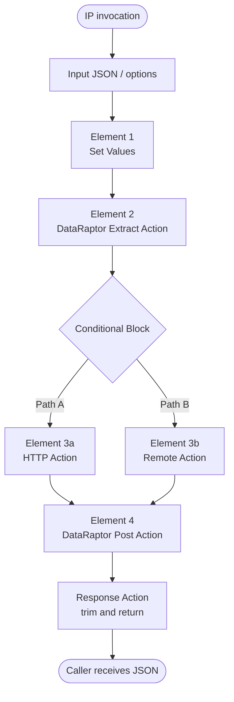

# Integration Procedures

Integration Procedures (IPs) are **server-side, declarative process orchestrators**. They run inside the Salesforce Apex runtime, have no UI, and exist to compose multiple data operations and integrations into a single transaction. An OmniScript or FlexCard typically calls one IP per Step, and the IP fans out to whatever DataRaptors, sub-IPs, Apex classes, and HTTP callouts it needs.

> **TL;DR:** An IP = an ordered list of Action elements that share a single mutable JSON payload. Actions read from the payload, do something, and write back into the payload. The final Response Action returns a (usually trimmed) subset of the payload to the caller.

The classic ApexHours framing — "Omnistudio Integration Procedures build integrations 10x faster… with no code" ([source](https://www.apexhours.com/integration-procedure-basics/)) — is accurate when the alternative is a hand-rolled Apex orchestrator. They earn their keep by collapsing what would be 5–10 SOQL queries plus an HTTP callout plus a DML batch into one declarative server call.

---

## When to use an IP

Use an IP when **all** of these apply:

1. There is no UI (the work is server-side only) — or the UI is an OmniScript / FlexCard that needs to delegate.
2. The work involves more than one read or write — otherwise a single DataRaptor is simpler.
3. You want **one** server round-trip for the caller, regardless of how many internal operations are needed.

Use it when **any** of these apply:

- You need to call multiple Apex methods, DRs, or external systems and merge their outputs.
- You need conditional branching that depends on the result of a previous step.
- You want to cache a frequently-requested response across users / sessions.
- You want to expose a REST endpoint backed by declarative logic.
- You want to encapsulate a chunk of business logic that several OmniScripts share.

Don't use an IP when:

- A single DataRaptor (Turbo Extract for read, Load for write) suffices — that's two clicks of unnecessary indirection.
- The logic is heavy, regex-rich, or deeply schema-introspective — write Apex, then call it from an IP via Remote Action.

---

## Anatomy

An IP is a tree of **elements** — same model as OmniScript — but most IPs are flat: a top-level sequence of Actions in execution order. Element types are different from OmniScript (no inputs, no displays, no Steps).



The shared mutable JSON object that flows through all elements is conventionally called the **payload** (also "data JSON", same as in OmniScript). Each element:

1. Reads the payload (using merge fields like `%PreviousElement:Id%`).
2. Does its work.
3. Writes its result into the payload at the path defined by `Response JSON Path` / `Response JSON Node`.

The final **Response Action** decides what subset of the payload to return to the caller. Anything not echoed by the Response Action is discarded.

---

## Action catalog

The IP designer palette groups elements into four categories.

### Data actions

Actions that read or write Salesforce data, almost always via a DataRaptor.

| Element | Wraps | Use |
|---------|-------|-----|
| **DataRaptor Extract Action** | Read DR (Extract) | Multi-object SOQL with formulas |
| **DataRaptor Turbo Action** | Read DR (Turbo Extract) | Single-object SOQL, fastest read |
| **DataRaptor Transform Action** | Transform DR | Reshape JSON, no DB I/O |
| **DataRaptor Post Action** | Load DR | Insert / update / upsert SObjects |

Configure each one with a DR Interface name. The DR's input bundle comes from a JSON path on the payload; its output bundle writes to the response path.

### Logic and control

Actions that do not perform I/O. They restructure the payload or branch execution.

| Element | What it does | Notes |
|---------|--------------|-------|
| **Set Values** | Computes formulas and writes scalar values into the payload | The IP equivalent of OmniScript's Set Values. Use for default values, payload reshaping, computed scalars. |
| **Conditional Block** | Wraps child elements; only executes them when a formula evaluates truthy | The primary branching primitive. |
| **Try/Catch Block** | Runs children; if any throws, the catch branch runs instead | Use for HTTP calls and Apex calls that may legitimately fail. |
| **Cache Action** | Reads or writes a Platform Cache key | Memoize expensive responses. Requires partition allocation (see Common mistakes). |
| **List Action** | Constructs a list from sources or unrolls a list into individual records | The declarative cousin of `LIST()` and `LISTSIZE()`. |
| **Loop Block** | Iterates a list and runs children once per element | The IP version of a for-loop. Beware governor limits per iteration. |

### Orchestration

Actions that compose other OmniStudio metadata.

| Element | What it does | Notes |
|---------|--------------|-------|
| **Integration Procedure Action** | Invokes another IP | The composition primitive. Use to factor reusable logic into sub-IPs. |
| **Response Action** | Defines what the IP returns | The terminal element. Multiple Response Actions can exist with different `executionConditionalFormula`s for early-exit behavior. |

### External and Apex

Actions that leave the IP boundary.

| Element | What it does | Notes |
|---------|--------------|-------|
| **Remote Action** | Calls an Apex class implementing `Callable` (Vlocity `VlocityOpenInterface` / `VlocityOpenInterface2`) | The escape hatch for logic that DRs and IPs cannot express. |
| **HTTP Action** | REST callout to an external service | Configure named credentials, headers, body. Supports `Use Continuation` for long-running calls. |
| **REST Action** | Same as HTTP Action with REST conventions | Mostly a UI affordance over HTTP Action. |
| **Apex Action** | Calls an Apex method directly (vs. Remote Action's Callable interface) | Less common; Remote Action is the standard approach. |
| **Matrix Action** | OmniStudio Calculation Matrix lookup | Specialized — used in CPQ/insurance pricing. |
| **DocuSign Action** | Triggers DocuSign envelope | Same as the OmniScript element, available in IP. |

---

## Merge fields and the payload

Like OmniScripts, IPs use `%path%` merge syntax to read from the payload. The path is the `Response JSON Path` of the source element, plus any nested keys.

```text
%Action_GetAccount:Account.Name%   # nested object
%Action_GetAccounts:Accounts[0].Id% # array index
%input.someParam%                   # caller's input map
%options.someOption%                # caller's options map
```

The IP also supports several special functions in formulas that OmniScript does not — most notably `LISTSIZE`, `FILTER`, `VLOOKUP`, `SORTBY`, `LIST`, and the Apex bridge `FUNCTION`. See [`formulas.md`](formulas.md) for the exclusivity matrix.

A subtle but important behavior: when an Action's response is set to a single-object scalar but a downstream merge field treats it as a list (or vice versa), formulas like `LISTSIZE()` may silently return 0 / 1 in counterintuitive ways. The repo's [`PRM_FormulaProbe_Procedure_1.oip-meta.xml`](../../force-app/main/default/omniIntegrationProcedures/PRM_FormulaProbe_Procedure_1.oip-meta.xml) was built specifically to characterize that behavior; if you suspect a formula misfire on lists, run the probe with sample inputs through the [`scripts/ip-debug/`](../../scripts/ip-debug/README.md) toolchain.

---

## Async invocation modes

How an IP runs depends on **who** calls it and **which mode** they pick. There are five distinct runtime modes.

| Mode | Caller waits for response? | Response delivered? | Best for |
|------|----------------------------|---------------------|----------|
| **Synchronous (default)** | Yes | Yes | Most cases — UI waits, data returns. |
| **Use Future** | No | No | Fire-and-forget side effects (notifications, audit writes). |
| **Fire and Forget** (Invoke Mode) | No, returns immediately | No | Same as Use Future but the OmniScript continues without queueing the work in `@future`. |
| **Non-Blocking** (Invoke Mode) | No, OmniScript continues | Yes, eventually | Long-running work where the user can keep filling out the next Step in parallel. |
| **Chainable** | Yes | Yes (after chains) | Long-running work where the IP exceeds per-transaction governor limits. Bypasses the limits by spinning up additional transactions. |

### Synchronous (default)

The default. The caller (OmniScript Action, FlexCard data source, REST consumer) blocks until the Response Action runs. Use this for anything where the caller needs the result.

### Use Future

Configured on the calling element (the IP Action inside an OmniScript or another IP). Marks the call as a Salesforce `@future` invocation:

- The caller returns immediately.
- The IP runs asynchronously in a background queue.
- The caller never sees the response.

Constraints inherited from `@future`:
- No DML on certain SObjects (`Setup` objects, `User` updates with field changes).
- Cannot pass non-primitive parameters (the IP designer mostly handles this for you).
- Cannot call other `@future` methods.

Use this for: audit log writes, email notifications, cache warming.

### Invoke Mode: Fire and Forget

Same effect as Use Future for the caller (no wait, no response), but the IP runs in the same transaction as the caller until the caller's transaction commits. Useful when:

- The IP must run before the caller's transaction commits (so the caller's commit "kicks off" something dependent).
- You don't want to consume a `@future` invocation budget.

### Invoke Mode: Non-Blocking

The IP runs concurrently and the caller continues. The caller eventually receives the response — for an OmniScript, this typically means the response lands while the user is on a later Step.

Use case: an OmniScript Step where the user enters demographic info, and the back-end starts a long-running validation IP. By the time the user has filled out three more Steps, the IP has finished and its response is available for the next Step that needs it.

### Chainable

Set on the IP itself (not the caller) via:

```json
"chainableQueriesLimit": 50,
"chainableDMLStatementsLimit": null,
"chainableCpuLimit": 2000,
"chainableHeapSizeLimit": null,
"chainableDMLRowsLimit": null,
"chainableQueryRowsLimit": null,
"chainableSoslQueriesLimit": null,
"chainableActualTimeLimit": null
```

When any of those limits is approached during execution, the IP automatically starts a new transaction (a "chain") and continues execution there. The caller receives a single combined response after all chains complete.

Use chainable when:
- You're processing a bulk list and the total SOQL/DML/CPU/heap will exceed per-transaction limits.
- The total work cannot be split into independent jobs (otherwise an Apex `Queueable` or `Batchable` is cleaner).

A chainable IP cannot be called from `@future` context, so combining `Use Future` with chainable is not supported. If you need both async and chainable, dispatch a Queueable that invokes the chainable IP synchronously.

---

## `propertySetConfig` cheat sheet

Every element in an IP carries a JSON blob called `propertySetConfig` in the metadata XML. It encodes the element's runtime configuration. The keys are stable across element types where they make sense.

### Common across most elements

| Key | Type | Purpose |
|-----|------|---------|
| `responseJSONPath` | string | The JSON path on the payload where this element's output lives. Example: `Account` for `payload.Account`. |
| `responseJSONNode` | string | An additional path qualifier — used when the IP wants to land output at a specific subkey. Often the same as `responseJSONPath`. |
| `executionConditionalFormula` | string | Formula. Element executes only if it evaluates truthy. Empty = always run. |
| `failOnStepError` | boolean | If true, an exception in this element halts the IP. If false, the error is recorded and execution continues. |
| `isActive` | boolean | If false, the element is skipped at runtime regardless of `executionConditionalFormula`. The designer toggle. |
| `chainOnStep` | boolean | If true, the IP starts a new chain after this element runs. Manual override of automatic chaining. |
| `restOptions` | object | Per-element options (rarely populated). |

### Set Values specific

| Key | Type | Purpose |
|-----|------|---------|
| `elementValueMap` | object | Map of `<keyName>` → `<formula>`. Each entry computes one value and writes it to `responseJSONPath.<keyName>`. |

Example from [`PRM_FormulaProbe_Procedure_1.oip-meta.xml`](../../force-app/main/default/omniIntegrationProcedures/PRM_FormulaProbe_Procedure_1.oip-meta.xml):

```json
{
  "responseJSONPath": "raw",
  "responseJSONNode": "raw",
  "elementValueMap": {
    "emptyList_size": "=LISTSIZE(%emptyList%)",
    "emptyList_isnotblank": "=ISNOTBLANK(%emptyList%)"
  },
  "failOnStepError": false,
  "isActive": true
}
```

After this element runs, `payload.raw.emptyList_size` and `payload.raw.emptyList_isnotblank` are populated.

### Response Action specific

| Key | Type | Purpose |
|-----|------|---------|
| `additionalOutput` | object | Extra fields to merge into the response. Each entry is a key → formula. |
| `returnFullDataJSON` | boolean | If true, returns the entire payload. If false, returns only `additionalOutput` (subject to `returnOnlyAdditionalOutput`). |
| `returnOnlyAdditionalOutput` | boolean | If true, the response is exactly `additionalOutput`. If false, `additionalOutput` is merged into whatever else is being returned. |
| `sendJSONPath` | string | Source path for caller-bound data. |
| `responseFormat` | string | `JSON` (default), `XML`, etc. |

The trio of `returnFullDataJSON`, `returnOnlyAdditionalOutput`, and `additionalOutput` is the response-trimming dial. The combination most teams want is `returnFullDataJSON: false`, `returnOnlyAdditionalOutput: true`, with `additionalOutput` enumerating exactly the keys the caller needs.

### IP-level (header)

The IP itself has a `propertySetConfig` with global settings.

| Key | Type | Purpose |
|-----|------|---------|
| `rollbackOnError` | boolean | If true, an unhandled error rolls back all DML done by the IP. Best practice = true. |
| `chainableQueriesLimit` | number | When SOQL count approaches this, start a new chain. |
| `chainableDMLStatementsLimit` | number | Same for DML. |
| `chainableCpuLimit` | number | Same for CPU time (ms). |
| `chainableHeapSizeLimit` | number | Same for heap. |
| `chainableActualTimeLimit` | number | Wall-clock cap for chaining. |
| `additionalChainableResponse` | object | Extra payload to attach to chain transitions. |
| `includeAllActionsInResponse` | boolean | Debug-only — returns every element's intermediate output. Leave false in production. |

---

## Best practices

### Cache where you can

The OmniStudio Cache Action stores responses in a configured Platform Cache partition. Cached entries skip the underlying work and return the cached payload directly.

By default, the `VlocityMetadata` and `VlocityAPIResponse` partitions have **zero allocation** — caching is silently a no-op until you allocate space. From [ApexHours](https://www.apexhours.com/integration-procedure-basics/):

> When a partition has no allocation, cache operations are not invoked. By default VlocityMetadata and VlocityAPIResponse Partition cache have zero space allocation.

**Setup → Platform Cache** is where you configure the partition allocations. Allocate a few MB to each.

Good caching candidates:
- Reference data (taxonomy lookups, network metadata).
- Per-user data that doesn't change within a session.
- External API responses with appropriate TTLs.

Bad caching candidates:
- User-specific transactional data that changes often.
- Anything tied to a session token that rotates.

### Trim every response

Every IP that returns to a browser caller should set `returnOnlyAdditionalOutput: true` on its terminal Response Action and enumerate only the keys the OmniScript needs. Sending the entire payload (default behavior with naive configuration) usually means returning multiple MB of intermediate state to the browser.

### Compose with sub-IPs

Factor any reusable logic into sub-IPs and call them via Integration Procedure Action. Benefits:
- Independently testable.
- Cacheable as a unit.
- Reusable from multiple parents.
- Easier to swap implementations.

A monolithic 30-element IP is harder to reason about than a 5-element parent that calls 4 sub-IPs.

### Use Conditional Blocks for early exit

Multiple Response Actions, each with an `executionConditionalFormula`, let an IP exit early under specific conditions:

```text
Element 1: Set Values (compute "isPending")
Element 2: Response Action (executionConditionalFormula: "%isPending% == true", returnOnlyAdditionalOutput: true)
Element 3: DataRaptor Extract Action (only runs if not pending)
Element 4: Response Action (terminal — runs if Element 2 didn't fire)
```

This avoids running expensive elements when the answer is already known.

### Pre-Transform / Post-Transform DRs sparingly

Every Action element supports Pre/Post Transform DRs. They reshape input/output JSON declaratively. Useful for one-off shape mismatches but easy to overuse — at three layers of nested transforms, the code path becomes unreadable. Prefer reshaping in `Set Values` when feasible.

### Test with the IP Debug runner

For any IP that takes more than a trivial input, build a JSON fixture and run it through the `scripts/ip-debug/` runner before the OmniScript ever touches it. See [`scripts/ip-debug/README.md`](../../scripts/ip-debug/README.md). The runner emits both the response and the raw debug log to disk, which is by far the fastest way to characterize the IP's behavior.

---

## Common mistakes

| Mistake | Symptom | Fix |
|---------|---------|-----|
| **No partition allocation** | Cache Actions appear to work but never persist anything | Allocate space to `VlocityMetadata` and `VlocityAPIResponse` partitions in Platform Cache setup |
| **Untrimmed response** | Slow OmniScripts, large network payloads | Set `returnOnlyAdditionalOutput: true` and enumerate only what the caller needs |
| **Apex called when DR would suffice** | Brittle code, harder testing | Replace with DR Extract / Load |
| **No IP for what should be one** | Five Action elements in one OmniScript Step where one IP would do | Wrap in an IP, return one combined payload |
| **`failOnStepError: false` everywhere** | Errors silently swallowed; payload looks correct but isn't | Default to `true`; only set to `false` when partial failure is genuinely OK |
| **Mixing Use Future and chainable** | Runtime "Future from future" exceptions | Dispatch a Queueable from the future call; the Queueable invokes the chainable IP synchronously |
| **Output disappears between elements** | A Set Values writes to `payload.x` but the next element sees `payload.x = null` | Verify `responseJSONPath` and `responseJSONNode` agree; check for trim-by-Response-Action upstream |
| **Forgot to retrieve before editing** | Local IP overwrites the org's newer version on deploy | Always `sf project retrieve start --metadata OmniIntegrationProcedure:<Type_SubType>` before editing |
| **moment.js / financial functions in IP formulas** | Runtime exception or NaN | Those are OmniScript-only. Use Apex `DateTime` / `Decimal` arithmetic, or compute in the OmniScript and pass the result in. See [`formulas.md`](formulas.md). |

---

## Payload-shape caveats

These are the IP-specific gotchas that aren't formula bugs but bite for similar reasons — the runtime treats payload shapes more loosely than your code expects, and the metadata wiring has several confusingly-named knobs. Pair this section with [`formulas.md` § Type coercion and list-vs-object caveats](formulas.md#type-coercion-and-list-vs-object-caveats) — that one covers the formula side; this one covers the IP-wiring side.

### 1. Single-row DR / sub-IP results collapse to objects

Cross-reference: this is the same caveat described in [`formulas.md` § 1 — A single-item list often collapses to an object](formulas.md#1-a-single-item-list-often-collapses-to-an-object). Inside an IP, the most common manifestation is:

- A `DataRaptor Extract Action` returns 1 row; `payload.accounts` is an object, not a 1-element array.
- A `DataRaptor Post Action` upserts 1 record; `payload.upserted` is an object, not a 1-element array.
- A sub-IP's Response Action emits a list with 1 item; the parent's `responseJSONPath` lands an object, not a list.

Defenses inside the IP:
- In any downstream `Set Values`, wrap with `LIST()`: `=LIST(%accounts%)`.
- In the DR mapping, force array brackets: `Account[*].Id -> output.accounts[].Id` (the trailing `[]` on the output side guarantees an array).
- In a `List Action`, wrap the source explicitly — `List Action` always emits a list regardless of input cardinality.

### 2. `responseJSONPath` vs `responseJSONNode` — what's the difference?

These two keys appear together in almost every element's `propertySetConfig` and they confuse everyone. The simplified mental model:

| Key | Meaning |
|-----|---------|
| `responseJSONPath` | Where on the **payload** the element writes its result. The path is dot-delimited (`payload.foo.bar` → `"foo.bar"`). |
| `responseJSONNode` | The node within the action's own raw response to extract. Used to drill into a wrapped response shape before assigning to `responseJSONPath`. |

For most Set Values and DR Actions, both keys are set to the same value (e.g. `"accounts"`) — meaning "take the whole response and put it at `payload.accounts`". The distinction matters only when the action returns a wrapped shape (`{IPResult: {accounts: [...]}}`) and you want to land just the `accounts` array — then `responseJSONNode = "IPResult.accounts"` and `responseJSONPath = "accounts"`.

Symptom of getting it wrong: the element runs successfully but downstream `%path%` references see the wrong shape (extra wrapping, or unexpectedly nested).

### 3. `additionalOutput` × `returnFullDataJSON` × `returnOnlyAdditionalOutput`

The Response Action has three knobs that interact non-obviously. The combinations:

| `returnFullDataJSON` | `returnOnlyAdditionalOutput` | `additionalOutput` | Caller receives |
|----------------------|------------------------------|--------------------|-----------------|
| `true` | (ignored) | (ignored) | The entire payload, including every element's intermediate output |
| `false` | `false` | empty | The slice of payload at `responseJSONPath`/`sendJSONPath` |
| `false` | `false` | populated | The slice of payload **plus** `additionalOutput` keys merged in |
| `false` | `true` | populated | **Only** `additionalOutput` — payload is fully replaced |
| `false` | `true` | empty | An empty object `{}` (probably not what you want) |

The combination most teams want is `returnFullDataJSON: false`, `returnOnlyAdditionalOutput: true`, with `additionalOutput` listing only the keys the caller needs. That gives you bulletproof response-trimming and explicit naming.

If your caller is suddenly receiving 10x more data than expected, check whether someone toggled `returnFullDataJSON: true` for debugging and forgot to flip it back.

### 4. Pre-Transform vs Post-Transform — naming is from the action's perspective

Every Action element supports a Pre-Transform DataRaptor and a Post-Transform DataRaptor. The names are from the **action's own perspective**, not the data flow:

- **Pre-Transform DR** — runs **before** the action executes, reshaping the **input** that the action will see.
- **Post-Transform DR** — runs **after** the action executes, reshaping the **output** before it lands at `responseJSONPath`.

So a Pre-Transform on a DR Extract Action reshapes the parameters fed to the DR; a Post-Transform reshapes the rows the DR returned.

A common mistake: configuring a Post-Transform expecting it to "re-massage the data after the IP step ahead of this one ran" — that's wrong. Post-Transform only sees this action's own output. If you need to reshape the broader payload, do it in a `Set Values` element after the action.

### 5. Element name collisions silently overwrite

Two sibling elements (same parent, both at the same `level`) with the same `name` don't error at design time. The second one's output silently overwrites the first one's at the payload level, and downstream `%firstName%` references resolve to the second's output. Always namespace: `SV_BuildPayload`, `SV_PostFix`, `Action_GetAccount`, `Action_GetContact`.

### 6. `failOnStepError` cascades inconsistently

Setting `failOnStepError: false` on an element means "if this throws, swallow it and continue" — but the swallowed error doesn't always get logged. The downstream payload sees `null` or partial state where it expected output. If a critical IP is mysteriously producing corrupt payloads, audit every element's `failOnStepError`; teams sometimes flip these to false during debugging and forget to revert.

The IP-level `rollbackOnError` is independent: it controls whether unhandled exceptions roll back DML. Best practice = `rollbackOnError: true`, `failOnStepError: true` everywhere except where partial failure is genuinely OK (notifications, audit).

### 7. `Use Future` swallows the response

Even with a fully-populated Response Action, an IP invoked with `Use Future: true` from the caller delivers no response back to the caller. The `additionalOutput` is computed and lost. If you rely on the response, do not use Use Future — pick `Invoke Mode: Non-Blocking` instead.

### 8. Sub-IP responseJSONPath nests

When a parent IP calls a sub-IP via Integration Procedure Action with `responseJSONPath: "subResult"`, the sub-IP's full response lands at `payload.subResult`. If the sub-IP itself terminates with a Response Action that has `additionalOutput.foo`, then the parent sees `payload.subResult.foo`.

A common bug: the parent's downstream formula expects `%subResult.foo%` but a developer changed the sub-IP's response shape and now it's `%subResult.IPResult.foo%`. Always retrieve and inspect the sub-IP before assuming its response shape is what your parent code expects.

### 9. Reserved-ish JSON keys

A handful of keys are intercepted by the OmniStudio framework and have special meaning: `error`, `errorMessage`, `errorCode`, `vlcStatus`, `vlcMessage`, `IPResult`. Avoid using these as your own data keys — prefix with a domain marker (`PRM_error`, `applicationError`) instead. See [`formulas.md` § 11](formulas.md#11-reserved-ish-json-keys).

### 10. Cache keys without user scope

If a Cache Action's key is `"AccountsForReview"` (constant), every user in the org sees every other user's cached result. Always include the user Id in the cache key — `=CONCAT('AccountsForReview_', %USERID%)` — for any data that's user-scoped. Same goes for record-scoped cache: include the record Id.

### 11. `Set Values` with cross-row references

Cross-reference: see [`formulas.md` § 13](formulas.md#13-set-values-rows-referencing-each-other). Within a single Set Values element, whether row 2 can reference row 1's freshly-written value is runtime-dependent. If row 2 must see row 1's output, split into two Set Values elements — the element boundary is a guaranteed sequencing point.

### 12. The `%input%` and `%options%` namespaces

When an IP is invoked from anonymous Apex (or REST), the payload starts as:

```json
{
  "input": { ... whatever the caller passed ... },
  "options": { ... whatever the caller passed ... }
}
```

But when called from an OmniScript IP Action, the `input` map is **flattened** into the payload root (depending on `Send JSON Path` configuration on the OmniScript element). So the same IP receives:

- From anonymous Apex / REST: `%input.someField%`
- From OmniScript: `%someField%` (no `input.` prefix)

This is one of the highest-friction debugging traps: an IP that works perfectly via `scripts/ip-debug/` mysteriously fails when called from OmniScript, because the merge fields no longer resolve. Defensively, route both shapes through a Set Values that normalizes:

```text
{
  "normalizedInput": "=IF(ISNOTBLANK(%input.someField%), %input.someField%, %someField%)"
}
```

Or, more cleanly, configure the OmniScript IP Action's **Send JSON Path** to nest its data under `input`, matching the anonymous-Apex shape exactly.

### 13. DR Extract returning wrong shape

Cross-reference: see [`dataraptors.md` § Common pitfalls](dataraptors.md#common-pitfalls). The DR mapping table's `[*]` and `[]` syntax determines whether the output is an array or a scalar. A DR using `Account.Id -> output.id` (no brackets) returns the first row's Id as a scalar even if SOQL returned 100 rows — the other 99 are silently dropped. Always check both sides of every mapping.

---

## Exposing an IP as REST

An IP can be exposed as a REST endpoint by checking the **OmniScript Procedure Available** / **Web Component Enabled** / **Integration Procedure Signature** flags in the designer. Once exposed, callers can POST to:

```
/services/apexrest/<namespace>/v3/integrationprocedure/<Type_SubType>
```

with a JSON body matching the IP's expected input. Response shape matches whatever the terminal Response Action returns.

This is how non-OmniScript consumers (external apps, Mulesoft, Apex callouts) reach IPs. It's also how the [`scripts/ip-debug/run_ip.sh`](../../scripts/ip-debug/README.md) runner invokes an IP from anonymous Apex via `Omnistudio.IntegrationProcedureService.runIntegrationService`.
