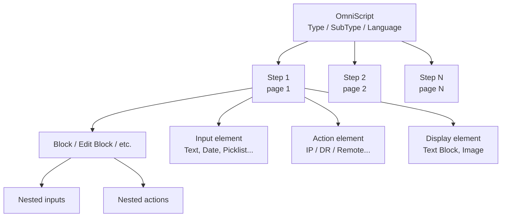

# OmniScripts

OmniScripts are guided, multi-step user interfaces — wizards, intake forms, applications — built declaratively from a hierarchy of metadata elements. They run **in the browser** as a Lightning Web Component, evaluating formulas in JavaScript, and they cannot persist anything on their own. Every read or write to Salesforce or to an external system happens through an Action element that reaches into the server tier.

> **TL;DR:** An OmniScript = a tree of `Step → Block → Element`s, plus a JSON data store that flows through the tree. The tree renders pages. Action elements mutate the JSON. Formulas read from and write to the JSON. The OmniScript ends with a Save action and (optionally) a Navigate action.

---

## Anatomy

An OmniScript is one root metadata file (`*.os-meta.xml`) that contains an ordered list of elements arranged in a tree. The hierarchy is:



- **OmniScript** — the root. Identified by a tuple `(Type, SubType, Language, Version)`. The launching URL is `?omniscript__type=<Type>&omniscript__subType=<SubType>&omniscript__language=<Language>`. The `Version` is the metadata version, not part of the URL.
- **Step** — one screen. Each Step renders as a page with Previous / Next buttons. Steps are the only element type that produces a page break.
- **Block** — a logical group of elements inside a Step. Several flavors (plain Block, Edit Block, Action Block, Type Ahead Block, Radio Group). Blocks are organizational; they do not by themselves cause page breaks.
- **Element** — a single field, action, or display widget. Elements are the leaves of the tree.

Every node in the tree has a unique **API Name** (also called Element Name). At runtime, OmniStudio assembles the JSON data store using these names as keys, namespaced by their parent. A Text element named `FirstName` inside a Step named `ApplicantInfo` ends up at JSON path `ApplicantInfo.FirstName`. That path is what you reference from formulas (see [Merge field syntax](#merge-field-syntax) below).

---

## The data store

Every OmniScript instance has a single mutable JSON object (often called "the data JSON") that lives in the browser. It has three notable layers:

1. **Pre-fill / context data** — passed in from the launching URL parameters (e.g. `c__ContextId`), context resolution, or a pre-fill DataRaptor on the OmniScript header.
2. **User input** — every Input element binds to `<step>.<element>` and updates the data JSON when the user types/selects.
3. **Action results** — every Action element writes its response to a JSON node defined by `Response JSON Path` / `Response JSON Node`. By convention this is named after the action (`Action_GetAccount`, etc.).

When the OmniScript ends, the entire data JSON is what gets persisted (typically by a DataRaptor Post Action or an Integration Procedure Action invoked from the final Step). Anything not written to a server-side store is lost when the user navigates away.

---

## Element catalog

OmniScript elements fall into five categories. Salesforce groups them this way in the designer palette, and the categorization matches their runtime behavior.

### 1. Group elements

Group elements organize the tree without doing work themselves.

| Element | Purpose | Notes |
|---------|---------|-------|
| **Step** | Page break — one Step renders as one screen with Previous/Next | Required at the top level. Use Step labels as the section names users see. |
| **Block** | Organizational grouping inside a Step | No runtime effect besides layout. Useful for collapsing a group with a single Conditional View. |
| **Action Block** | Groups multiple Action elements that should execute in parallel | Only Action elements may be children. Useful for kicking off independent reads on Step entry. |
| **Edit Block** | Repeatable group of inputs — users can add/edit/delete N child records | Backed by an array in the data JSON. Pair with a Read DR (extract) and a Save DR (load) on the same Block. |
| **Radio Group** | Questionnaire-style multi-question screen with the same answer set | All children share one option list. Saves as `{ question1: answer, question2: answer, ... }`. |
| **Type Ahead Block** | Input block that searches as the user types | Backed by a DR Extract or IP. The user sees a dropdown of matching results. Selecting a row populates downstream fields. |

### 2. Input elements

Input elements collect user data. Each input has a label, an API name, validation, and a binding to a JSON path in the data store.

| Element | Backing type | When to use |
|---------|--------------|-------------|
| **Text** | string | Free-form short text. Configure max length, regex, character validation. |
| **Text Area** | string | Multi-line text. Set rows count and max length. |
| **Number** | number | Integer or decimal numbers. Configure min/max and step. |
| **Currency** | number | Numbers with a currency symbol. The symbol is display-only. |
| **Phone** | string | Phone numbers. Configure format mask. |
| **Email** | string | Email addresses. Built-in regex validation. |
| **URL** | string | URLs. Built-in regex validation. |
| **Password** | string | Masked input. Use sparingly — OmniScripts are not the right place for credentials. |
| **Date** | ISO date string | Date picker. Configure min/max and default. |
| **DateTime** | ISO datetime string | Date + time picker. |
| **Time** | string | Time picker (no date). |
| **Checkbox** | boolean | Single boolean. |
| **Picklist** | string or array | Single-select dropdown. Source can be static, an SObject picklist field, or a DR. |
| **Multi-select** | array of strings | Like Picklist but the user can select multiple options. |
| **Radio** | string | Single-select radio buttons. Use when there are ≤5 options and you want them all visible. |
| **Type Ahead** | object | Search-as-you-type with results from a DR or IP. The selected row is bound as an object, not a scalar. |
| **File Upload** | object | Uploads to ContentVersion. Configure allowed types and max size. |
| **Geolocation** | object `{lat, lng}` | Captures lat/lng from the browser's geolocation API. |
| **Address** | object | Multi-field address composite (street, city, state, postal, country). |

Configure validation declaratively on each input — required, regex, custom error message — rather than scripting it in formulas. The designer renders the error inline and ties it into the Step's Next-button enablement.

### 3. Action elements

Action elements do work. Every Action is a server round-trip, an LWC method call, or a navigation. Most server-bound actions support `Use Future`, `Cache`, `Pre-Transform DR`, and `Post-Transform DR` properties.

| Element | What it does | Example |
|---------|--------------|---------|
| **DataRaptor Extract Action** | Runs a Read DR (Turbo Extract or Extract) | Fetch the current Account on Step entry |
| **DataRaptor Transform Action** | Runs a Transform DR on the data JSON | Reshape user input before saving |
| **DataRaptor Post Action** | Runs a Load DR to insert/update SObjects | Persist the form on Save |
| **Integration Procedure Action** | Invokes another IP synchronously or asynchronously | Heavy lifting on Step entry or Save |
| **Remote Action** | Calls an Apex class implementing `Callable` (Vlocity `VlocityOpenInterface` / `VlocityOpenInterface2`) | Custom server logic that doesn't fit a DR or IP |
| **REST Action** | Direct REST callout from the browser | Rare — usually preferable to do it server-side via an HTTP Action inside an IP |
| **HTTP Action** | Direct HTTP callout from the browser | Same caveat as REST Action |
| **Email Action** | Sends an email via Salesforce email | Quick confirmation emails. Templated email is a separate `EmailTemplate`. |
| **DocuSign Action** | Triggers DocuSign envelope | Requires the DocuSign for Salesforce package |
| **Set Values** | Computes and writes values into the data JSON | Pure-formula calculations, defaulting fields, building IP input payloads |
| **Set Errors** | Adds a validation error to the OmniScript | Conditional, formula-driven validation |
| **Calculation Action** | Runs a Calculation Procedure | OmniStudio Calculations product (rarely used outside CPQ) |
| **Calculation Procedure Action** | Same as above | — |
| **Navigate Action** | Navigates to another OmniScript, FlexCard, URL, or record page | Used at the end of a flow to land the user somewhere meaningful |
| **OmniScript Action** | Embeds a child OmniScript | Use sparingly — debugging nested OmniScripts is painful |

A common pattern is to put one **Integration Procedure Action** at the start of each Step that needs server data, and one at the end of the OmniScript to save and navigate. Avoid scattering five DataRaptor Extract Actions when one IP can wrap them.

### 4. Display elements

Display elements render content but do not collect input or trigger work.

| Element | Renders | Notes |
|---------|---------|-------|
| **Text Block** | Static or merge-field-driven text | Supports rich text and HTML. Use for instructions, headers, summaries. |
| **Image** | Static or URL-driven image | Source can be a static resource, a public URL, or a merge field. |
| **Line Break** | Visual horizontal rule | Pure layout. |
| **File Preview** | Inline preview of a ContentVersion | Pair with a File Upload to let users review before saving. |
| **Aggregate** | Count / sum / avg over a JSON list | Lightweight rollup without invoking a server action. |
| **Custom Lightning Web Component** | A custom LWC | Use when no built-in element fits. The LWC must implement the OmniScript element interface. |
| **Embed** | An external URL in an iframe | Rarely used. |

### 5. Functions / Formula elements

These elements execute formulas (see [`formulas.md`](formulas.md) for the full reference).

| Element | Use |
|---------|-----|
| **Formula** | One-off calculation that writes a value into the data JSON. Can also drive Conditional View. |
| **Set Values** | Multiple formulas at once — each row writes to a JSON node. The workhorse for default values, derived fields, and IP input payload construction. |
| **Aggregate** | List rollups (sum/count/avg/min/max). |

The vast majority of "do something with the data we already have" logic should live in `Set Values`, not in custom code. If the same formula appears in three places, factor it into the parent Step's Set Values.

---

## Element properties (universal)

Every element supports these properties. They are configured via the designer property panel and stored on the `propertySetConfig` JSON of the element in the metadata XML.

| Property | What it does |
|----------|--------------|
| **Name (API Name)** | Stable identifier. Used in merge fields and JSON paths. Cannot be reused inside the same parent. |
| **Label** | Human-readable label rendered next to the input. |
| **Help Text** | Tooltip / hover help. |
| **Conditional View** | Formula-driven visibility. The element renders only when the formula evaluates truthy. |
| **Show / Hide** | Static visibility toggle, often combined with Conditional View. |
| **Required** | If true, blocks Step Next until populated. Inputs only. |
| **Validation (Pattern)** | Regex pattern with custom error message. |
| **Default Value** | Formula-driven or static initial value. |
| **Read Only** | Renders but cannot be edited. |
| **Bundle (Element Class)** | Custom CSS class for fine-tuned styling. |

For Action elements specifically, four more properties matter:

| Property | What it does |
|----------|--------------|
| **Pre-Transform DataRaptor** | Reshapes the input JSON to the action before it runs. |
| **Post-Transform DataRaptor** | Reshapes the response JSON before it lands in the data store. |
| **Use Future** | Runs asynchronously; the Action does not wait. The response is discarded. Only safe for fire-and-forget side-effects. |
| **Use Continuation** | Long-running HTTP callouts. Reserved for callouts ≥30s. |

---

## Merge field syntax

OmniScript formulas read from the data JSON using a `%path%` syntax. The same syntax works in any field that takes a formula — Conditional View, Default Value, Pre-Transform JSON Path, Set Values, etc.

| Syntax | Resolves to |
|--------|-------------|
| `%FieldName%` | The element named `FieldName` at the OmniScript's data root |
| `%StepName:FieldName%` | The element `FieldName` inside Step `StepName` |
| `%Action_GetAccount:Account.Name%` | Drill into a nested JSON node returned by an Action |
| `%List[0].Name%` | First element of a JSON array |
| `%TODAY%` | Special: today's date in the user's timezone |
| `%NOW%` | Special: current datetime |
| `%CONTEXTID%` | Special: the URL `c__ContextId` parameter |
| `%USERID%` | Special: the running user's Id |
| `%LANGUAGE%` | Special: the running user's language |
| `%CURRENCY%` | Special: the running user's currency code |

The path is **case-sensitive** and must match the API Name exactly. If the path resolves to a node that doesn't exist, formulas like `ISBLANK(%missing%)` return true; arithmetic on a missing node typically yields `NaN` or 0 depending on the operator.

The colon `:` traversal is OmniScript-flavored — JSONPath uses `.` everywhere; OmniStudio uses `:` between Step and child element. Inside a child object, `.` and `[N]` work as JSONPath.

---

## Design patterns

### Linear wizard

The default pattern: Step 1 → Step 2 → ... → Step N → Save → Navigate. Use this for any guided process where every user goes through every screen.

Tips:
- Put a single IP Action on each Step's entry to load just-in-time data. Don't load everything up front.
- Put a single IP Action on the final Step's exit (or on a dedicated "Save" Step) for the persistence.
- Show a progress indicator (built-in via Step labels).

### Branching

Use **Conditional View** at the Step level to skip Steps based on prior input. The data JSON is preserved across branches — a hidden Step's elements simply aren't rendered or required.

Common variants:
- **Eligibility branch** — Step 1 collects yes/no. Step 2A renders if yes; Step 2B renders if no.
- **Type-driven branch** — picklist on Step 1 routes to one of N follow-up Steps.

Avoid more than three nested branching conditions in a single OmniScript. At that point, factor the branches into separate child OmniScripts and use an OmniScript Action.

### Looping with Edit Block

The Edit Block represents a list. The user adds items with an Add button, edits any item, and removes items with a Delete button. The data JSON node is an array; each row in the array is an object whose keys are the inputs inside the Edit Block.

Use this for "add N addresses", "list all certifications", "select all locations" patterns.

**Edit Block configuration gotchas (these bite everyone the first time):**

- **Edit Block name MUST match the JSON path returned by the source DataRaptor.** If the DR returns `output.financialAccounts[]` and the Edit Block is named `accounts`, the data won't bind. The DR's output array key has to equal the Edit Block's API Name.
- **The Id field must be marked as a Duplicate Key and hidden from the UI.** Without this, save-and-reopen flows lose the row identity and treat every existing row as a new insert.
- **Conditional Views and merge fields default to row 0 only.** If you reference `%FinancialAccount.Type%` from a child of an Edit Block, the formula evaluates against the **first** row only. To reference the current iteration's row, append `|n` to the path: `%FinancialAccount|n.Type%`. Without `|n`, conditional fields apply only to the first record and silently no-op for the rest.
- **Edit Block doesn't auto-clear between Steps.** When the user navigates back-and-forward, search-result data from a prior Edit Block can persist. Clear it explicitly via a `Set Values` element or by enabling "Allow Clear" in the Edit Block properties (which alone may not be enough — pair with Set Values for reliability).
- **Set Values writing into nested Edit Block JSON can produce broken JSON** (a known Salesforce issue). When updating a child key inside an Edit Block row, structure the path explicitly:

  ```json
  "userInfo": {
    "programCode": "=IF(%userInfo:programCode%==NULL,\"LCD\",%userInfo:programCode%)"
  }
  ```

### Type-ahead select

A common pattern for picking an existing record:

1. Type Ahead Block with a DR Extract or IP backing it.
2. The user types; results dropdown appears; user clicks one.
3. The selected row binds to a JSON node (`Lookup_Account`).
4. Downstream Steps reference `%Lookup_Account.Id%`, `%Lookup_Account.Name%`, etc.

This is much more responsive than a flat Picklist when the source has more than ~50 candidates.

**Type Ahead performance caveats:**

- **The DR runs on every keystroke.** A user typing "Smith" fires five DR calls. Always set a `LIMIT` (typically 10–25) in the DR to cap result size and protect SOQL row limits.
- **Filter the search scope explicitly.** If the OmniScript is bound to an Account, pass the AccountId as an input parameter to the DR and filter by it. Don't search globally.
- **Output JSON should be flat.** Nested parent objects inside Type Ahead results slow rendering — the dropdown re-renders on every keystroke, and deep JSON parses cost more than flat JSON.
- **Match the Typeahead Key property** to the searched field (e.g., `Contact.Name`). Mismatches cause the dropdown to show but selection to bind nothing.

### Pre-fill from context

The OmniScript header has a **DataRaptor Interface** property that runs a DR before Step 1 renders, using URL parameters as inputs. Use this to fetch the record being edited (`c__ContextId`), the running user, the parent Case, etc., all in one server call so Step 1 is responsive.

### Save then navigate

The conventional ending pattern:

1. A "Save" Step (visible or hidden).
2. An Integration Procedure Action that performs all writes and returns the new record's Id.
3. A Navigate Action that routes to the new record's detail page.

If the IP fails, the OmniScript stays on the Save Step and shows the error. The user can correct and retry without losing the data JSON.

---

## Common pitfalls

### Overloaded steps

Putting 30 inputs and 4 Actions in one Step kills performance and confuses users. If a Step has more than ~15 inputs or more than 2 Actions, split it.

### Missing validation

OmniScripts will happily save garbage if you don't configure required, regex, and Conditional Show/Hide validation on every input. Audit each input's properties before deploying.

### Hardcoded picklist values

Don't hand-type picklist options into the OmniScript metadata. Source them from the SObject picklist via a DR or from a Custom Metadata record so they stay in sync with the schema.

### JSON node naming collisions

If two elements at the same level have the same API Name, the second silently overwrites the first in the data JSON. Use prefixes (`In_`, `Out_`, `Tmp_`) or Step-level scoping to avoid collisions.

### Set Values doing too much

A `Set Values` element with 30 rows is a code smell. Either it should be 30 separate Formula elements (so designers can find them) or it should be moved into a server-side IP / DR Transform.

### Heavy logic in Conditional View

A Conditional View formula like `IF(AND(NOT(ISBLANK(%a%)), %b% == "X", LISTSIZE(%c%) > 0), true, false)` runs on every keystroke in any element that touches `a`, `b`, or `c`. Keep these formulas trivially cheap. If the logic is non-trivial, compute it once in `Set Values` and reference the boolean.

### Forgetting to retrieve before editing

OmniScripts are deployed source-of-truth metadata. The org's copy is almost always newer than the local working copy because designers/admins edit directly in production sandboxes. **Always retrieve before opening an OmniScript file:**

```bash
sf project retrieve start --metadata OmniScript:<Type_SubType_Lang> -o {{ORG_ALIAS}}
```

See [`org-conventions.md`](org-conventions.md) for the {{ORG_NAME}}-specific deploy guardrails. (This applies to every OmniStudio metadata type, not just OmniScripts — IPs and DRs drift just as often.)

### moment.js in non-OS contexts

`MOMENT()` and a handful of other JS-library-backed functions only exist in the OmniScript runtime. They will crash an Integration Procedure or DataRaptor at runtime. See [`formulas.md`](formulas.md) for the exclusivity matrix.

---

## Custom LWC integration

When a built-in OmniScript element doesn't fit, drop in a custom Lightning Web Component via the Custom LWC element. There are several non-obvious requirements and gotchas — get any of these wrong and the LWC either fails to load, fails to communicate with the OmniScript, or silently leaks data across navigations.

### Required boilerplate

A custom LWC used inside an OmniScript must:

1. **Extend `OmniscriptBaseMixin`** to receive script context and expose `omniNextStep()` / `omniPrevStep()` / `omniNavigateTo(...)` / `omniSaveState(...)` / `omniGetSaveState(...)`:

   ```javascript
   import { LightningElement } from 'lwc';
   import { OmniscriptBaseMixin } from 'omnistudio/omniscriptBaseMixin';

   export default class MyCustomLWC extends OmniscriptBaseMixin(LightningElement) {
     // ...
   }
   ```

2. **Add `<runtimeNamespace>omnistudio</runtimeNamespace>` to the LWC's `*.js-meta.xml`.** Without this, the OmniStudio runtime can't resolve the component at runtime, and the OmniScript shows a blank slot where the LWC should appear.

3. **Import `pubsub` as the default export, not as a named export.** This is the single most common LWC-integration bug:

   ```javascript
   // Correct
   import pubsub from 'omnistudio/pubsub';
   // or, in newer runtimes:
   import pubsub from 'lightning/omnistudioPubsub';

   // Incorrect — fails at module-resolve time
   import { pubsub } from 'omnistudio/pubsub';
   ```

4. **Register pubsub handlers in `connectedCallback`, not `renderedCallback`.** `renderedCallback` fires on every re-render and would re-register on every keystroke. Always pair registration with `unregister` in `disconnectedCallback` to avoid memory leaks and duplicate handlers.

### Custom LWCs are re-instantiated on Step navigation

This is the highest-friction caveat. When the user navigates back to a Step containing a custom LWC, the LWC is **re-mounted**: `disconnectedCallback` fires on the old instance, `connectedCallback` fires on a fresh instance, and any state held in component properties is gone.

If the user filled out fields inside your custom LWC and then clicked Previous and came back, all those fields appear blank.

**Fix:** persist state to the OmniScript data JSON before unmount, and restore on mount.

```javascript
// Save before unmount
disconnectedCallback() {
  this.omniSaveState(this.localData, this.uniqueKey, true);  // usePubSub=true
  super.disconnectedCallback?.();
}

// Restore on mount
connectedCallback() {
  super.connectedCallback?.();
  this.localData = this.omniGetSaveState(this.uniqueKey) ?? this.defaultData;
}
```

Alternatively, dispatch the data into the OmniScript's data JSON via a custom event so the OmniScript stores it in a regular JSON node. Then on remount, the LWC reads from that node rather than restoring its own state.

### Communicating between LWC and OmniScript

Three mechanisms, in roughly increasing order of complexity:

| Mechanism | Direction | Best for |
|-----------|-----------|----------|
| Element properties (read-only) | OmniScript → LWC | Static config and data shapes the LWC needs at mount |
| Custom events | LWC → OmniScript | Notifying the script that the user did something (validation, selection) |
| `omnistudio/pubsub` | Bidirectional | Cross-Step communication, FlexCard-to-OmniScript, multi-component coordination |

For pubsub specifically: enable the **Pub/Sub** checkbox in the OmniScript's Messaging Framework section and define key/value pairs there. Inside the LWC, subscribe with `pubsub.register(channel, eventName, callback)`.

### Common LWC-integration bugs

| Symptom | Cause |
|---------|-------|
| LWC slot is blank, no error in console | Missing `<runtimeNamespace>omnistudio</runtimeNamespace>` in meta.xml |
| `pubsub is not a function` at module load | Imported as named instead of default |
| Handler fires multiple times | Registered in `renderedCallback`, not `connectedCallback` |
| State lost on Previous/Next | Component re-mounted; missing `omniSaveState` / `omniGetSaveState` |
| `omniNextStep is not a function` | Forgot `OmniscriptBaseMixin` extends |
| Memory leak in long-lived OmniScripts | Forgot `pubsub.unregister` in `disconnectedCallback` |

---

## Build and deploy

### Designer

1. **Setup → OmniStudio → OmniScripts** in any org with the OmniStudio managed package or unlocked package installed.
2. Create a new OmniScript: pick `Type`, `SubType`, `Language` (the URL identity).
3. Drag elements from the palette onto the canvas. Configure properties in the right panel.
4. **Preview** runs it inline. **Activate** publishes the version. Only one version of a given `(Type, SubType, Language)` is active at a time.

### Versioning

Every save creates a new metadata version. Old versions stay deployable but become inactive. The metadata file is named `<Type>_<SubType>_<Lang>_<Version>.os-meta.xml`. The launching URL omits the version — Salesforce always picks the active one.

When you retrieve an OmniScript, you get whichever version is active in the org. To compare an old version to the active one, retrieve both by version-suffixed name.

### Dependencies

An OmniScript depends on:

- The **DataRaptors** referenced in DR Action elements.
- The **Integration Procedures** referenced in IP Action elements.
- The **Apex classes** referenced in Remote Action elements.
- The **Lightning Web Components** referenced in Custom LWC elements.
- The **Static Resources** for any image references.
- The **Custom Metadata** types referenced as picklist sources.
- Any **EmailTemplates** or **DocuSign Templates** referenced.

When deploying an OmniScript, deploy all of its dependencies in the same package. Salesforce won't activate an OmniScript with a dangling reference.

### Pre-deploy checklist

1. Retrieve the active version from the target org.
2. Run a manual smoke test in the source org's preview.
3. Confirm all dependencies are also being deployed (or already exist in the target).
4. Validate first with `--dry-run` or `--check-only` (whichever your CLI version supports).
5. Run the full deploy with the appropriate test class scope.
6. Verify activation in the target org's OmniScript designer.

See [`patterns.md`](patterns.md#performance-and-governor-limits) for performance and limits considerations and [`patterns.md#debugging`](patterns.md#debugging) for debugging tips that apply at deploy time as well as runtime.
