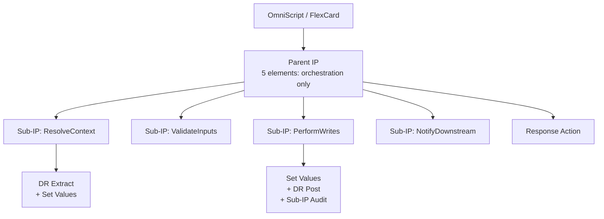

# OmniStudio Patterns, Performance, and Anti-patterns

This doc collects the cross-cutting concerns that apply to any OmniStudio build: how to compose IPs and OmniScripts cleanly, how to stay inside governor limits, how to debug what's broken, and the recurring anti-patterns to avoid.

If you're building one OmniScript or one IP from scratch, you can mostly get away without consulting this. By the time you have a flow with three IPs, two OmniScripts, and a stack of DataRaptors, every section here matters.

---

## Architecture patterns

### Server-side first

Re-stating the architectural principle from [`README.md`](README.md): anything that does not need to render or react in real time belongs in an Integration Procedure, not in OmniScript Set Values or formulas. Six concrete consequences:

1. **One IP per Step entry, not five DR Actions.** Every Action is a network round-trip. Wrap multi-DR reads in an IP and call the IP once.
2. **Validation belongs server-side once data is in flight.** Use built-in OmniScript validation for inputs the user is typing, but validate cross-record consistency in an IP on the Save Step.
3. **Formulas with `FILTER`/`SORTBY`/`VLOOKUP`/`LISTSIZE` belong in IPs.** OmniScript's formula engine cannot do these reliably. See [`formulas.md`](formulas.md).
4. **Caching only works server-side.** OmniScript's "Cache" property is shorthand for "let the server cache this Action's response". The browser does no caching of its own.
5. **Trim the response.** Sending the entire IP payload back to the browser is wasted bandwidth and parse time. Use `responseJSONPath`, `additionalOutput`, and `returnOnlyAdditionalOutput` to send only what the next Step needs.
6. **The Apex bridge `FUNCTION()` is server-only.** Browsers can't call Apex from formulas. If you need Apex, do it in an IP.

### Sub-IP composition vs. monolithic IPs

A monolithic 30-element IP is a code smell. It's hard to test, hard to reuse, and hard to reason about.

The fix is sub-IPs: factor each cohesive chunk of logic into its own IP, then call them from a thin parent IP via Integration Procedure Action elements.



Benefits:
- Each sub-IP is independently testable through `scripts/ip-debug/`.
- Each sub-IP is independently cacheable.
- Each sub-IP is reusable from other parents.
- The parent stays small enough to fit on a screen.

Costs (small):
- A sub-IP call has overhead (one function-call's worth, not a network round-trip — they all run in the same Apex transaction).
- Indirection makes it harder to find where a specific bug lives. Mitigate with consistent naming.

The right level of granularity is "one sub-IP per cohesive concern". Don't make a sub-IP for every single DR call.

### Conditional Response Actions for early exit

Multiple Response Actions in the same IP, each with an `executionConditionalFormula`, lets the IP return early under specific conditions without running the rest of the elements:

```text
Element 1: DataRaptor Extract Action — fetch the record
Element 2: Set Values — compute "isAlreadyClosed"
Element 3: Response Action (executionConditionalFormula: "%isAlreadyClosed% == true",
                            returnOnlyAdditionalOutput: true,
                            additionalOutput: { status: "skipped" })
Element 4: Sub-IP — heavy work that should only run if not already closed
Element 5: Response Action — runs only if Element 3 didn't fire
```

This is meaningfully cheaper than wrapping Elements 4–5 in a Conditional Block, because the IP literally exits at Element 3 instead of skipping over them.

### Cache strategy

OmniStudio actually has **two** caches, and confusing them produces surprising results.

| Cache type | Behavior | Configured via |
|------------|----------|----------------|
| **Scale Cache** | Automatic, runtime-managed cache for DR / IP responses based on `cacheType` and `cacheTTL` settings on the procedure. | Procedure metadata; runs without Platform Cache space. |
| **Platform Cache** | Salesforce-org-level cache that the Cache Action element writes to and reads from. | Setup → Platform Cache; requires partition allocation. |

Two partitions matter on the Platform Cache side:

- **`VlocityMetadata`** — for OmniStudio's own metadata caching (component definitions, etc.).
- **`VlocityAPIResponse`** — for IP/DR response caching invoked via Cache Action.

By default, both partitions have **zero allocation**, which means cache reads silently miss and cache writes silently no-op. Platform Cache capacity also varies by Salesforce edition:

| Edition | Default Platform Cache space |
|---------|------------------------------|
| Enterprise | 10 MB |
| Unlimited / Performance | 30 MB |
| Other editions | 0 MB |

To use Platform Cache:

1. **Setup → Platform Cache** in the org.
2. Find or create the partition.
3. Allocate session cache and/or org cache space (start with 5–10 MB each).
4. Apply.

Cache keys are typically `<userId>:<paramHash>` for per-user data or `<paramHash>` for global reference data. Configure TTL based on how stale the data can be.

**Cache invalidation gotchas:**

- **Don't cache IPs that perform DML.** If the IP writes records, caching its response means the second invocation skips the writes entirely — the user thinks the save worked but nothing happened. Cache only read-side procedures.
- **DM (DataRaptor / Data Mapper) cache may not auto-refresh.** If your DM cache returns stale data after the underlying SObject changes, enable `AllTriggers` under Setup → Custom Settings → Trigger Setup. To force-clear the DM scale cache from Apex, call `omnistudio.ScaleCacheService` (the public service for cache flushing).
- **Sharing-rule enforcement on cached data.** By default, cached data may bypass record-level sharing — if user A's request populated the cache, user B reading the same key gets user A's data. Enable `CheckCachedMetadataRecordSecurity` to enforce sharing settings on cached entries.
- **Always include user Id in the key for user-scoped data.** A cache key of `"AccountsForReview"` (constant) will leak data across users. Use `=CONCAT('AccountsForReview_', %USERID%)`.

Good caching candidates:
- Reference data lookups (taxonomy codes, network metadata).
- Configuration data (custom metadata reads).
- Per-user resolved data that's stable across the session.
- External API responses with reasonable TTLs.

Bad candidates:
- User-specific transactional data that changes between requests.
- Anything tied to a token that rotates.
- Data with large fan-out (cache size explosion).
- IPs that do DML.
- IPs whose response includes records the user must not see.

### Trim payload at every boundary

A 1 MB IP response is a 1 MB browser parse and a 1 MB network transfer. Apply trimming at every boundary:

| Layer | How to trim |
|-------|------------|
| **DataRaptor Extract** | Configure output mappings to include only needed fields. Don't `SELECT *`. |
| **Sub-IP → Parent IP** | Sub-IP's terminal Response Action sets `returnOnlyAdditionalOutput: true`. |
| **IP → OmniScript** | Top-level Response Action with `returnOnlyAdditionalOutput: true` and an explicit `additionalOutput` whitelist. |
| **OmniScript → next Step** | Use Set Values to project only the fields the next Step needs into a fresh JSON node. |
| **OmniScript → Save** | The Save IP receives only what's needed for the write. Don't pipe the entire data JSON. |

If at any boundary you find yourself emitting kilobytes of fields that the next layer ignores, fix it.

### One Action per Step entry

OmniScript Steps render fastest when they have:
- Zero or one Action element on entry (preferably zero — let the prior Step prepare data).
- All inputs defaulted via merge fields to data already in the JSON store.
- Conditional Views that are cheap to evaluate.

A Step that fires three Actions on entry takes three round-trips to render. Combine them into one IP that returns the union of what those three Actions provided.

---

## Performance and governor limits

### Per-transaction limits

OmniStudio runs inside the standard Apex transaction. The same governor limits apply:

| Limit | Default | OmniStudio implication |
|-------|---------|------------------------|
| SOQL queries | 100 | Each DR Extract / Turbo Extract is at least one SOQL. Each `:input` parameter does not add a query, but joined sources do. |
| SOQL rows | 50,000 | A DR returning 10,000 rows leaves only 40,000 for everything else in the transaction. |
| DML statements | 150 | Each DR Load is one DML per output SObject — but Loads with multiple SObjects bulkify them. |
| DML rows | 10,000 | A Load with 200 rows of 5 SObjects each is 1,000 rows. |
| CPU time | 10,000 ms (sync) / 60,000 ms (async) | Every Set Values formula and Conditional Block evaluation accumulates CPU. |
| Heap size | 6 MB (sync) / 12 MB (async) | A massive payload accumulating across IPs blows the heap. |
| Async invocations | 50 per transaction | If you `Use Future` 50 IPs from one OmniScript, you're at the limit. |

### Observing limits in IP responses

When `includeAllActionsInResponse: true` on the IP header, the response includes per-element execution metadata. This is debug-only, but useful for finding which element is consuming the most resources.

In {{ORG_NAME}}, the [`scripts/ip-debug/`](../../scripts/ip-debug/README.md) toolchain captures the full debug log alongside the response, so per-element CPU time and SOQL counts are observable without changing the IP itself.

### Chainable IPs

When per-transaction limits aren't enough, mark the IP as chainable by setting any of the `chainable*Limit` properties on the IP header:

```json
{
  "chainableQueriesLimit": 50,
  "chainableDMLStatementsLimit": null,
  "chainableCpuLimit": 2000,
  "chainableHeapSizeLimit": null,
  "chainableActualTimeLimit": null
}
```

When SOQL approaches `chainableQueriesLimit` (50 queries used out of 100 available), CPU approaches `chainableCpuLimit` (2000 ms used out of 10,000 available), etc., the IP automatically starts a new chained transaction. The chain inherits a fresh set of governor limits and continues execution. The caller sees one combined response.

Trade-offs:
- Chains can be slow (each chain is a fresh transaction startup).
- Chains can hit **per-day** limits if heavily used.
- Chains cannot be invoked from `@future` context (no future-from-future).

### When to chain vs. when to use Apex Batch

| Workload | Use chainable IP | Use Apex Batchable |
|----------|------------------|-------------------|
| 200 records, multi-step server logic | ✅ | ❌ |
| 50,000 records, mostly DML | ❌ | ✅ |
| Multi-hour processing | ❌ | ✅ |
| Mid-flight UI feedback | ✅ (caller waits) | ❌ |
| Sequential dependencies between rows | ✅ | ⚠️ (use stateful Batchable) |

Rule of thumb: chainable IPs scale to a few thousand operations. Beyond that, queue an Apex Batchable from the IP and let the Batchable do the heavy lifting. Notify the user via an Email Action or a custom notification.

### DR-level performance

- **Turbo Extract beats Extract** by ~30–50% on the same query, because Turbo bypasses the formula engine.
- **Loads with formulas** evaluate formulas per input row. Push formulas into a preceding Transform DR if you're loading more than ~50 rows.
- **Conditional View formulas in OmniScripts** run on every keystroke that touches their dependencies. Keep them trivially cheap. Compute booleans once in Set Values and reference them.

### Network round-trips

Every DR Action and IP Action in an OmniScript is one round-trip. A typical Step rendering looks like:

```text
1. Browser: render Step shell
2. Browser → Server: IP Action 1 (read context)
3. Server → Browser: response
4. Browser: render Step inputs
5. User interaction (no round-trip)
6. Browser → Server: IP Action 2 (Save / Next)
7. Server → Browser: response
8. Browser: render next Step
```

Two round-trips minimum per Step. If your Step has five Actions firing on entry, that's six round-trips, and the user sees a noticeable rendering pause. Consolidate.

---

## Debugging

### Apex debug logs

Most OmniStudio debugging starts with an Apex debug log. To capture one:

1. Setup → Debug Logs → Add a trace flag for your user.
2. Pick log levels appropriate for what you're debugging:
   - **Apex Code: FINEST** — IP and DR execution, every formula evaluation.
   - **Database: FINE** — every SOQL and DML.
   - **Workflow: INFO** — flow / process builder firings.
3. Run the OmniScript or invoke the IP.
4. Setup → Debug Logs → download the most recent log.

The log's `USER_DEBUG` markers from OmniStudio look like:

```
USER_DEBUG|[1]|DEBUG|=== START IP: PRM_PractitionerCreationContainer ===
USER_DEBUG|[1]|DEBUG|=== Element: SV_BuildPayload (Set Values) ===
USER_DEBUG|[1]|DEBUG|elementValueMap: { ... }
USER_DEBUG|[1]|DEBUG|=== End Element ===
```

A 5 MB log limit truncates very chatty IPs. Mitigations:
- Lower verbosity for unrelated categories (set Workflow to `WARN`, etc.).
- Split the IP into smaller scenarios.
- Use the IP debug runner (next section), which captures logs per invocation.

### The {{ORG_NAME}} `scripts/ip-debug/` toolchain

For any IP-driven debugging, the fastest workflow is:

1. Curate an input JSON in [`scripts/ip-debug/inputs/`](../../scripts/ip-debug/inputs/).
2. Run [`scripts/ip-debug/run_ip.sh`](../../scripts/ip-debug/README.md) with `--ip <Type_SubType> --input <path>`.
3. Inspect the response JSON and debug log written to `scripts/ip-debug/outputs/`.

The runner generates an anonymous Apex script that calls `Omnistudio.IntegrationProcedureService.runIntegrationService(...)`, captures the result, and emits markers in the debug log so the response/error can be cleanly extracted. No metadata deploys, no UI, no Salesforce session.

This is the right tool for:
- Reproducing a production failure with a known input.
- Comparing IP behavior across orgs.
- Characterizing list-formula edge cases (see [`PRM_FormulaProbe`](formulas.md#probing-formula-behavior)).
- Smoke-testing IP changes before deploying to a UI.

See [`scripts/ip-debug/README.md`](../../scripts/ip-debug/README.md) for full usage.

### The `responseJSONNode` pruning pitfall

A single most common debugging issue: **an element appears to run but downstream merge fields see `null`**. The cause is almost always one of:

1. The element's `responseJSONPath` doesn't match where the downstream formula is reading from.
2. An upstream Response Action with `returnOnlyAdditionalOutput: true` trimmed the node out of the payload before the downstream element ran.
3. The element's `executionConditionalFormula` evaluated falsy and the element silently skipped.

To diagnose:
- Set `includeAllActionsInResponse: true` on the IP header temporarily.
- Re-run via the debug toolchain.
- Inspect the response — every element's intermediate output is now visible.
- Find the element where the data should appear; verify it ran; verify its output path.
- Set `includeAllActionsInResponse: false` again before deploying.

### Conditional skip diagnostics

Two ways an element can silently not run:

| Why | Where to look |
|-----|---------------|
| `isActive: false` | The designer toggle. If someone disabled the element, it's skipped regardless of conditions. |
| `executionConditionalFormula` evaluates falsy | The formula. If it references a payload node that doesn't exist, the result is typically falsy. |

Both are visible in the metadata XML. Grep for the element's name to find its `propertySetConfig` block.

### OmniScript debugging

For OmniScript-side debugging:
1. Activate the OmniScript in a sandbox.
2. Use the **Preview** mode in the designer — it shows the data JSON live in a side panel.
3. Open the browser DevTools console. OmniStudio logs Action requests and responses there.
4. The data JSON is also available via `window.omnistudioDataJson` in some configurations.

For DataRaptor debugging:
1. Use the **Preview** tab in the DR designer.
2. Provide sample input.
3. Inspect the output JSON before wiring it into an IP / OmniScript.

### List-vs-object debugging

If a formula appears correct but `LISTSIZE` returns the wrong number, `FILTER` returns nothing, or `%path:Field%` resolves to a scalar where you expected a list — the input shape is almost certainly different from what you think. The most common cause is the **single-row collapse**: a DR or sub-IP that returns 1 row often emits a bare object instead of a 1-element array, and downstream list functions silently misbehave.

The full taxonomy of these gotchas — single-row collapse, `FILTER` output cardinality, `%path:Field%` colon-traversal semantics on objects vs lists, `ISBLANK` / `LISTSIZE` disagreement on empty vs missing, date / boolean / picklist coercion — lives in [`formulas.md` § Type coercion and list-vs-object caveats](formulas.md#type-coercion-and-list-vs-object-caveats). Pair that with [`integration-procedures.md` § Payload-shape caveats](integration-procedures.md#payload-shape-caveats) for the IP-wiring side (Pre/Post-Transform naming, `additionalOutput` interaction, sub-IP responseJSONPath nesting, and the `%input%` namespace gotcha).

Quick-reference fixes:

| Symptom | First thing to try |
|---------|--------------------|
| `LISTSIZE(%list%)` returns wrong number | Wrap with `LIST()`: `LISTSIZE(LIST(%list%))` |
| `FILTER(...)` returns nothing on 1 match | Wrap result with `LIST()`: `LIST(FILTER(LIST(%list%), '...'))` |
| `%path:Field%` is a scalar where a list was expected | The upstream node is an object, not a list. Force the upstream to a list with a `Set Values` or DR `[]`/`[*]` brackets. |
| `IF(%bool%, ...)` always picks the truthy branch | The boolean is a string `"false"`. Compare explicitly: `IF(%bool% == true, ...)` or wrap `=TOBOOLEAN(%bool%)` in IPs. |
| `DATEDIFF` returns NaN | The date is a string the runtime didn't auto-parse. Wrap `=TODATE(%date%)` in IPs. |
| Cache action returns another user's data | Cache key isn't user-scoped. Add `%USERID%` to the key. |

---

## Anti-patterns

### Heavy logic in OmniScript Set Values

A Set Values element with 30 rows of nested `IF`/`AND`/`FILTER`-attempts is a code smell. Migrate to a server-side IP. The browser is the worst place to run business logic.

### Apex called from IP for things DR can do

Writing a Remote Action that does `[SELECT Id, Name FROM Account WHERE Id = :id]` is wasted code. A Turbo Extract DR does the same thing declaratively, with no test coverage burden. Reserve Apex for genuinely Apex-only work (regex, schema introspection, complex date math, external retries).

### Untrimmed responses

A 1 MB JSON response means:
- 1 MB across the network.
- 1 MB of browser parse time.
- 1 MB of memory the OmniScript runtime holds onto for the rest of the session.

Always set `returnOnlyAdditionalOutput: true` on terminal Response Actions and enumerate only what the caller needs.

### DataRaptor formulas inside Turbo Extract

Turbo Extract silently ignores formulas. If you need a formula, switch the variant to standard Extract.

### moment.js inside IP

`MOMENT()` calls in an IP context will throw at runtime. The function only exists in the OmniScript JS runtime. Use `FORMATDATE()` or Apex `DateTime` formatting instead.

### Five DR Extracts in a Step entry

Each DR Action is a network round-trip. Five DR Actions = five round-trips per Step entry. Wrap them in one IP that returns the combined data.

### Long-running OmniScripts without async

If a Step takes more than ~5 seconds to render, the user assumes the page is broken. Either:
- Move the heavy work to a prior Step, so it runs while the user fills in upstream inputs (`Invoke Mode: Non-Blocking`).
- Wrap the heavy work in a chainable IP with a progress indicator.
- Split the Step into smaller sub-Steps.

### `failOnStepError: false` everywhere

The default is `true`, and that's the right default. Setting it to `false` for every element silently swallows errors and produces successful-looking responses with corrupt payloads. Only use `false` for elements where partial failure is genuinely OK (e.g. notifications, audit writes).

### `useCache: true` without partition allocation

Setting `useCache: true` on Action elements without allocating Platform Cache space is a no-op. Verify the partition has space allocated before trusting any caching.

### Mixing Use Future and chainable

A `Use Future` IP cannot dispatch a chainable IP. If you need both, dispatch a Queueable Apex from the future call, and have the Queueable invoke the chainable IP synchronously.

### Editing without retrieving

OmniStudio metadata changes constantly in production sandboxes — admins, designers, and other developers all push edits. Local files drift within hours. **Always** retrieve before editing:

```bash
sf project retrieve start --metadata OmniScript:<Type_SubType_Lang> -o <org>
sf project retrieve start --metadata OmniIntegrationProcedure:<Type_SubType> -o <org>
sf project retrieve start --metadata OmniDataTransform:<Name> -o <org>
```

A styling-only diff applied to a stale file silently reverts other people's changes on the next deploy. See [`org-conventions.md`](org-conventions.md) for the {{ORG_NAME}}-specific deploy guardrails.

### DML, API, or Remote Action calls inside a Loop Block

A Loop Block iterates a list and runs its child elements once per iteration. Putting a DataRaptor Post Action, HTTP Action, or Remote Action inside the Loop Block multiplies that work by the iteration count — and with it, the SOQL/DML/callout governor limits.

```text
Loop Block over %accounts%   (200 items)
  └── DataRaptor Post Action  ← runs 200 times → 200 DML statements
                                Per-transaction limit is 150 → fails on item 151
```

Fix: move the DR call **outside** the Loop. Build a list of all the records to write inside the Loop (using a `List Action` or accumulating in `Set Values`), then call the DR Post once with the full list. The DR will bulkify into a single DML statement.

The same applies to HTTP / Remote Action calls — every iteration is a callout, and the callout limit per transaction is 100. Bulk what you can; queue what you cannot.

### IP continuing to run after an error

When `failOnStepError: false` lets the IP keep going after a critical element failed, every downstream element processes corrupt or empty payload data and produces results that look successful but are wrong. The Response Action returns a 200 with a partially-populated body, and the caller has no way to tell.

Fix: leave `failOnStepError: true` (the default) on every element where failure should halt the IP. Use Try/Catch Block explicitly when you want partial-failure semantics, and have the catch branch emit a clear error key in the response.

### Non-selective queries in DataRaptors

`LIKE '%foo%'` and other wildcard-on-both-sides filters force a non-selective SOQL query. On small tables this is harmless; on tables with hundreds of thousands of rows, it triggers Salesforce's non-selective query timeout (typically 120 seconds). The query simply errors out — and as data grows, the same DR that worked yesterday silently breaks.

Fix:
- Prefer leading-edge wildcards: `LIKE 'foo%'` (selective if the field is indexed).
- Restructure searches to use exact matches against an indexed external Id or `Id`.
- For full-text search, use SOSL (`FIND ... IN ALL FIELDS`) instead of SOQL.

---

## Deployment caveats

OmniStudio deployment is materially harder than standard Salesforce metadata deployment. The components have JSON-stored cross-references (PropertySetConfig, Definition, InputObjectName/OutputObjectName) that the platform's standard validation can't fully verify, and there are two distinct deployment paths with different version-handling semantics.

### Change Sets are unreliable for OmniStudio

Change Sets don't properly handle the nested cross-references between OmniScripts, IPs, DataRaptors, FlexCards, custom LWCs, and Apex. Deployments succeed but components don't activate, or activate referencing the wrong version, or activate but show only a loading spinner at runtime. **Don't use Change Sets** for any non-trivial OmniStudio deployment.

Use either:
- **Vlocity Build Tool (VBT)** — exports interdependent "DataPacks" with their cross-references intact. Industry standard for managed-package (`vlocity_cmt__`) runtime deployments.
- **`sf project deploy start` via SFDX** — for OmniStudio Standard Runtime (where OmniScripts are stored as standard `OmniProcess` metadata) and for the underlying platform metadata (custom fields, permissions, Apex) regardless of OmniStudio runtime.

### Validation is a false positive risk

Both `sf project deploy validate` and `vlocity packDeploy --validate` can pass even when:

- Referenced LWCs are missing in the target.
- Referenced FlexCards aren't deployed.
- Custom fields the DR depends on don't exist.
- Apex classes invoked via Remote Action are missing.
- Custom Metadata records used as picklist sources aren't seeded.

Symptom: deploy "succeeds", but launching the OmniScript shows a loading spinner forever or a generic "Sorry, an error occurred" toast. Console logs may or may not surface the missing dependency.

**Mitigation:**

1. Document every component's dependencies in a deployment checklist.
2. Deploy platform metadata (custom fields, custom objects, permission sets) **first** via SFDX, then OmniStudio components via VBT or `sf project deploy`. The reverse order is the most common cause of broken deploys.
3. Smoke-test every deployed OmniScript and IP in the target org — automated with [`scripts/ip-debug/`](../../scripts/ip-debug/README.md) for IPs, manual for OmniScripts.
4. Don't trust a green validation as a guarantee.

### `packDeploy` overwrites the active version

The legacy Vlocity Build Tool command `packDeploy` updates the existing active version **directly** instead of creating a new version. Result: the version history is lost; the change is essentially irreversible without a manual export of the previous version first.

**Fix:** use `packGetDiffsAndDeploy` instead, which preserves versioning by creating a new active version per deploy.

### OmniScripts may stay inactive after a deploy

A documented Vlocity issue: deployed OmniScripts sometimes land in the target org as **inactive**, despite being active in the source. The OmniScript designer shows them as deployed but the launching URL returns "OmniScript not found" or shows a blank page.

**Fix:** after every deploy, open the OmniScript in the designer, **deactivate** the version, and **reactivate** it. This forces the runtime to re-resolve dependencies and bind correctly.

### Two runtimes, two deployment paths

Salesforce is migrating OmniStudio off the Vlocity managed package onto a "Standard Runtime" with native metadata types. The two runtimes have different deployment semantics:

| Aspect | Managed Package Runtime | Standard Runtime |
|--------|-------------------------|-----------------|
| Namespace | `vlocity_cmt__` | None (core Salesforce) |
| Storage | Custom objects (`vlocity_cmt__OmniScript__c`) | Standard objects (`OmniProcess`, `OmniUICard`) |
| Deploy via | Vlocity Build Tool | `sf project deploy` (Salesforce CLI) |
| Versioning | Often creates new active version per deploy | Preserves version state across orgs |
| Migration | — | Use OmniStudio Migration Assistant CLI plugin |

Before migrating to Standard Runtime, run the migration assistant in **Assess Mode** to identify unsupported components (custom Angular elements, certain element types, deprecated formulas). The assessment must complete cleanly before attempting actual migration. Custom Angular components must be re-implemented as LWCs.

### Circular references between components

OmniScripts can reference IPs that reference DataRaptors that reference Apex that calls back into another OmniScript via Navigate Action. Circular references are technically allowed and don't error at deploy time, but they make iteration difficult — you can't deploy any component in the cycle without all of them being present in the target.

**Fix:** structure dependencies as a DAG. If you need bidirectional communication, use pub/sub or a shared data service rather than circular metadata references.

---

## Cross-references

- [`omniscripts.md`](omniscripts.md) — OmniScript fundamentals
- [`integration-procedures.md`](integration-procedures.md) — IP fundamentals
- [`dataraptors.md`](dataraptors.md) — DataRaptor fundamentals
- [`formulas.md`](formulas.md) — formula reference and the OS↔IP exclusivity matrix
- [`org-conventions.md`](org-conventions.md) — {{ORG_NAME}}-specific deploy and naming rules
- [`scripts/ip-debug/README.md`](../../scripts/ip-debug/README.md) — IP debugging toolchain
